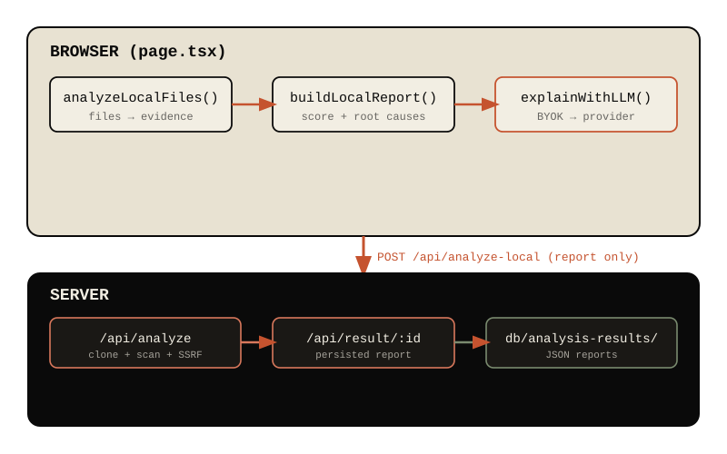

# repo-quality-analyzer

**[English](README.md) | [Türkçe](README.tr.md)**


A privacy-first, local repository quality analyzer. Clone a repository (or
scan a local folder) and get a health score across 14 static-analysis
dimensions — all in your browser, with bring-your-own-key LLM explanations.

| | |
|---|---|
| Analysis | in your **browser** — code never leaves your machine |
| Engine | deterministic, black-box audited — **0 false positives / 0 false negatives** on 417 synthetic repos |
| Languages | TypeScript · Python · Go · Ruby · Java (3 language families) |
| Findings | 14 categories, all severities, per-line evidence with second-pass validation |
| AI explanations | optional, bring-your-own-key (OpenAI, Anthropic, Gemini, Azure, OpenRouter, Ollama) |
| Deployment | `npm run dev`, Docker, or self-hosted |

---

## Why this tool?

**1. Privacy is the default, not a feature flag.**

File contents are scanned **in the browser**. For local-folder analysis the
server only receives the compact report — never your source code. For
GitHub-URL analysis the repo is shallow-cloned on the server and scanned
with the same engine. Either way, your code is not stored, logged or
re-shared anywhere.

**2. The engine is proven, not aspirational.**

Every detector ships with a black-box auditor: the project generates 417
miniature repositories with *known* ground truth, runs the **real** engine
against them, and fails the build if a false positive or false negative
appears. See [Audit](#audit) for the full details and current numbers.

**3. Bring your own key — no account, no billing.**

AI explanations are an optional layer. Configure your own provider key in
the UI (stored in your browser's localStorage) and generate explanations
with one click. The key is **never sent to the server**; the call goes
straight from your browser to the provider.

**4. Multi-language with consistent rules.**

TypeScript, Python, Go, Ruby and Java share the same thresholds and the same
severity calibration — a 50-line function is a finding in Python exactly as
it is in Go. Language-specific syntax (indentation-based blocks, `end`
blocks, brace counting) is handled per family.

---

## Features

| Dimension | What it detects |
|---|---|
| Security | hardcoded secrets (API keys, AWS, GitHub tokens, Firebase, JWT), command injection, weak crypto (MD5/SHA-1/DES) |
| Architecture | god classes (>20 methods), tight coupling (>15 imports), circular dependencies (2-level) |
| Quality | long functions (>50 lines), deep nesting (≥6 levels), high complexity (≥25 branches), empty exception handlers, magic numbers |
| Metrics | large files (>600 lines), TODO debt |
| Testing | missing test files (repos with >5 files and no tests) |
| Docs | documentation presence |
| Reports | health score (A–F), root causes, per-line evidence, knowledge graph, roadmap, explanations (LLM or deterministic) |

Every finding carries:

- `file_path` + `line` + `evidence_snippet` (the actual source line)
- `severity` (`critical` → `low`), calibrated per category and audited
- `confidence` (per-detector, honest about heuristic findings)
- `validation_status`: **verified / partial / unverified** — produced by a
  second, independent pass over the same code
- deduplicated by file+category with a per-pair cap (5) — three injections
  in one file are three findings, not one

---

## Architecture



```
browser (page.tsx)
 ├─ analyzeLocalFiles()  → scans files, builds evidence   [local-analysis.ts]
 ├─ buildLocalReport()   → score + root causes + graph    [local-analysis.ts]
 ├─ explainWithLLM()     → optional BYOK LLM call          [llm.ts]
 └─ POST /api/analyze-local (report only — no file content)
server
 ├─ /api/analyze         → clone repo (URL) + same engine + SSRF validation
 ├─ /api/result/:id      → retrieve persisted report
 ├─ /api/benchmark       → live engine self-test (runs the real 417-repo audit)
 └─ db/analysis-results/ → persisted JSON reports
```

### The engine (`src/lib/local-analysis.ts`)

A deterministic hybrid of **regex scanners** and **structural scanners**:

- **Language families** — `brace` (TS/JS/Java/C#/Go/Rust/Kotlin/C/C++/PHP),
  `python` (indentation-based blocks), `ruby` (`def...end` blocks). Block
  detection, nesting depth and branch counting are family-aware.
- **Masking layer** — comments, strings, template literals, triple-quoted
  docstrings and regex literals are masked before pattern matching, so
  `// const key = "sk-..."` is *not* a finding. Division (`x / 2`) is not
  mistaken for a regex literal; character classes inside regexes are handled.
- **Import resolution** — relative paths, `@/` aliases, Python `from x
  import`, Go `import "pkg"`, Ruby `require_relative`, Java package paths;
  self-imports are not cycles; commented-out imports are ignored.
- **Second-pass validation** — every finding is re-checked with an
  independent method (re-detection, entropy checks, re-counting). The
  result is a `validation_status` the UI shows honestly.
- **Multi-finding** — all findings are collected, not just the first:
  `capEvidenceByPriority` keeps up to 5 per file+category and applies the
  final severity-ordered cap.

### Scoring

`computeHealthScore` produces an 8-dimension, ratio-based, scale-independent
score:

| Dimension | Weight |
|---|---|
| Security | 15% |
| Architecture | 20% |
| Quality | 25% |
| Testing | 15% |
| Documentation | 10% |
| Performance | 5% |
| Developer Experience | 5% |
| Scalability | 5% |

A critical hardcoded secret applies a −15 penalty. Grades: **A ≥ 85,
B ≥ 70, C ≥ 55, D ≥ 40, F < 40**. Because the score is ratio-based, a
5-file repo and a 5,000-file repo are scored with the same ruler.

---

## Audit — how the engine is kept honest

The project contains its own **black-box auditor** (`npm run audit`):

1. `audit/generator.mjs` generates hundreds of miniature repos with **known
   ground truth** — clean variants, single/double/multi issues, benign
   look-alike traps (comments, strings, regex literals, test files,
   generated/encrypted/backup files), boundary thresholds (just below and
   just above every limit), across 5 languages.
2. The **real** engine (the exact code path the UI uses, via
   `src/lib/cli.ts`) runs against every repo.
3. `audit/compare.mjs` computes false positives / false negatives, and the
   runner additionally verifies **severity calibration** per category.
4. Patterns the engine intentionally cannot catch (concatenated secrets,
   base64 blobs, dynamic crypto) are tracked as **known limitations** —
   reported separately, never hidden inside the pass/fail numbers.

Current result:

```
AUDIT — 417 repos | 539 expected findings
  FALSE POSITIVE: 0 | FALSE NEGATIVE: 0 | Precision 100% | Recall 100%
  SEVERITY MISMATCH: 0 (all 14 categories produce the expected severity)
  KNOWN LIMITATIONS: 11 (intentional FNs, tracked separately)
```

Categories covered: `hardcoded_secret`, `command_injection`, `weak_crypto`,
`empty_handler`, `long_function`, `deep_nesting`, `high_complexity`,
`large_file`, `god_class`, `tight_coupling`, `circular_dependency`,
`magic_number`, `todo_debt`, `missing_tests` — across TS / Python / Go /
Ruby / Java.

The **Engine Self-Test** tab in the UI runs this same audit live
(`/api/benchmark` — 417 repos in ~1 second) and shows the numbers in the
product itself, not just in the README.

The audit is a regression guard: **any** engine change must keep
`FALSE POSITIVE: 0 | FALSE NEGATIVE: 0 | SEVERITY MISMATCH: 0`. See
[CONTRIBUTING.md](CONTRIBUTING.md).

### Real-world golden tests

`tests/golden-real.test.ts` locks the engine's behavior against real
repositories (TUSLA, and this project itself) — score range, secret count,
and FP-free guarantees. If an engine change shifts a real-world score
outside its locked range, the test fails.

---

## LLM explanations (bring your own key)

- Providers: **OpenAI, Anthropic, Google Gemini, Azure OpenAI, OpenRouter,
  Ollama (local)**.
- Flow: run an analysis → click **"Generate LLM explanations"** on the LLM
  status card → the call goes from your browser directly to the provider.
- The prompt is compact and grounded: the top 10 root causes plus the top 3
  verified evidence snippets. The model is asked to **explain the verified
  claims, not invent new ones**.
- Output is parsed as JSON (`{sections:[{title, body, confidence}]}`) with a
  plain-text fallback — a malformed response never breaks the report.
- Errors are surfaced as human-readable messages (quota, invalid key,
  timeout), and the analysis itself remains fully deterministic and usable
  without any LLM.

**Honest note:** LLM-generated explanations are not persisted yet — they
live in the current session state. They are an enhancement layer; the
deterministic explanations are the baseline.

---

## Getting started

### 1. Run it

> Requirements: **Node.js 20+** and npm (or bun).

```bash
npm ci
npm run dev               # http://localhost:3000
```

No environment configuration is needed — `.env.example` is provided as a
safe default and contains no secrets. Reports are persisted to
`db/analysis-results/` automatically.

Production (standalone server):

```bash
npm run build
npm start                 # http://localhost:3000
```

Or with Docker:

```bash
docker compose up --build   # http://localhost:3000
```

### 2. Analyze

- **Local folder**: drag & drop or pick a folder — analyzed in your browser.
- **GitHub repo**: paste a URL — shallow-cloned on the server (with SSRF
  validation) and scanned with the same engine.

### 3. (Optional) AI explanations

Open the settings in the UI, pick a provider and paste your key. After an
analysis, click **"Generate LLM explanations"** on the LLM status card.

---

## Security model

- **No upload**: local-folder code never reaches the server.
- **No key storage on the server**: LLM keys live in your browser.
- **SSRF protection**: `/api/analyze` accepts only public http/https URLs;
  `localhost`, private IP ranges (10.x, 172.16–31.x, 192.168.x, 169.254.x),
  IPv6 loopback/link-local/ULA and DNS-rebinding targets are rejected
  (`validateRepositoryUrl`).
- **Scoped cloning**: clones live under `validation_workspace/` with
  read-only reuse; no git write operations.
- **No build hacks**: `ignoreBuildErrors` is off — TypeScript errors fail
  the build, in CI and locally.

See [SECURITY.md](SECURITY.md).

---

## Known limitations

The engine is deliberately transparent about what it cannot detect. These
are tracked as **known limitations** in the audit and reported in
`npm run audit`:

- **Concatenated secrets**: `"sk-" + "abc..."` (the regex finds single
  tokens)
- **Base64-encoded secrets**
- **Dynamic crypto algorithms**: `createHash(process.env.ALGO)`
- **No taint/flow analysis**: `const cmd = "ls"; exec(cmd)` is reported even
  though `cmd` is static (we err on the side of flagging)
- **3+ level import cycles** (A→B→C→A) are not detected — only 2-level
- **No duplication / dead-code / CVE database analysis**
- **Secrets inside `.env` files** are not scanned (env files are excluded by
  design — they shouldn't be committed anyway)
- **Stripe-style tokens** (`sk_live_...`) are not matched by the secret
  regex (tire-delimited `sk-` is)
- **No AST/parser** — the engine is regex + structural scanning; it cannot
  understand *intent* (e.g., whether a value is truly user-controlled)

These are honest boundaries, not hidden defects: each one is a deliberate
trade-off between precision, speed and simplicity, and each is documented
where a user can see it.

---

## Development

```bash
npm run test        # 164 unit + integration + golden tests
npm run lint
npm run audit       # engine black-box audit (must stay 0/0/0)
npm run build       # TypeScript errors fail the build
```

- Engine changes **must** keep the audit green (`0 FP / 0 FN / 0 severity
  mismatch`). New detectors should ship with audit variants: clean, single,
  double, neighbour, multi, noise + boundary thresholds + benign traps.
- Golden tests lock real-world behavior (see
  [CONTRIBUTING.md](CONTRIBUTING.md)).
- The CI pipeline (GitHub Actions) runs lint, tests, the audit, the
  production build and a Docker image build on every push.

---

## FAQ

**Is my code uploaded anywhere?** No. Local-folder analysis happens entirely
in your browser. Only the compact report (no file contents) is persisted.

**Is the "0 false positives" claim real?** It is measured, not claimed: the
audit suite is generated with known ground truth and run against the real
engine on every CI run. That said, the audit is *synthetic* — real-world
code is messier, and the golden tests (real repos) are the second line of
defense. We keep the README honest about both.

**Do I need an LLM API key to use the tool?** No. Everything except
AI-generated explanations works without a key, and the explanations are
deterministic by default.

**Why not SonarQube / Semgrep / ESLint?** Those are excellent, deeper tools.
This project focuses on three things they typically don't: privacy-first
browser analysis, a provably FP/FN-free rule set (via the audit), and a
single consistent score across 5 languages with zero configuration.

---

## License

MIT — see [LICENSE](LICENSE).
