# Yazılım Tasarım Dokümanı (SDD)

## Proje: `github-repo-analyzer`

> **Doküman Sürümü**: 1.0
> **Durum**: Tasarım Aşaması (Architecture & Design Only)
> **Hedef Kitle**: Yazılım Mimarı, Kıdemli Geliştiriciler, DevSecOps Ekipleri
> **Doküman Tipi**: Software Design Document (SDD) + Architecture Decision Records (ADR)
> **Not**: Bu doküman yalnızca mimari tasarım içerir. Herhangi bir implementasyon / kaynak kod içermez.

---

## İçindekiler

1. [Yönetici Özeti](#yönetici-özeti)
2. [Projenin Genel Mimarisi](#1-projenin-genel-mimarisi)
3. [Mimari Desenlerin Değerlendirilmesi](#2-mimari-desenlerin-değerlendirilmesi)
4. [Modül Tasarımı](#3-modül-tasarımı)
5. [Klasör Yapısı](#4-klasör-yapısı)
6. [Veri Akışı](#5-veri-akışı)
7. [Domain Model](#6-domain-model)
8. [Analiz Motorları](#7-analiz-motorları)
9. [Plugin Sistemi](#8-plugin-sistemi)
10. [Cache Mimarisi](#9-cache-mimarisi)
11. [Config Mimarisi](#10-config-mimarisi)
12. [Error Handling Stratejisi](#11-error-handling-stratejisi)
13. [Logging Stratejisi](#12-logging-stratejisi)
14. [Performans Tasarımı](#13-performans-tasarımı)
15. [Güvenlik Tasarımı](#14-güvenlik-tasarışı)
16. [Rapor Mimarisi](#15-rapor-mimarisi)
17. [AI Entegrasyonu](#16-ai-entegrasyonu)
18. [Test Stratejisi](#17-test-stratejisi)
19. [Geliştirme Yol Haritası](#18-geliştirme-yol-haritası)
20. [Risk Analizi](#19-risk-analizi)
21. [Nihai Yazılım Mimarisi (Son Karar)](#20-nihai-yazılım-mimarisi-son-karar)
22. [Ek: ADR Özeti](#ek-adr-özeti)

---

## Yönetici Özeti

`github-repo-analyzer`, herhangi bir GitHub repository'sini (public, private, SSH, token tabanlı) klonlayan; **statik analiz, güvenlik denetimi, mimari inceleme ve AI destekli teknik rapor** üreten bir CLI uygulamasıdır. Hedef; **SonarQube + CodeClimate + GitHub Insights + Bandit + kıdemli bir Software Architect'in kod incelemesini** tek bir araçta birleştirmektir.

Bu doküman, projenin mimarisini, modül tasarımını, veri akışını, domain modelini, analiz motorlarını, plugin sistemini, cache, config, error handling, logging, performans, güvenlik, rapor, AI entegrasyonu, test, yol haritası ve risk analizini kapsamlı biçimde ele alır. Sonuç bölümünde nihai mimari kararı **ADR formatında** sunulur.

**Önerilen Nihai Mimari**: Hexagonal (Ports & Adapters) çekirdek + Plugin mimarisi + Modular Monolith organizasyonu + Pipeline tabanlı analiz orkestrasyonu.

---

## 1. Projenin Genel Mimarisi

### 1.1 Sistemin Çalışma Prensibi

Sistem, bir **pipeline (ardışık düzen)** mimarisinde çalışır. Kullanıcı bir GitHub URL'si verir; sistem bu URL'i çözer, repoyu güvenli şekilde klonlar (cache'li), dil tespiti yapar, paralel analiz motorlarını çalıştırır, bulguları toplar, AI motoruyla sentezler ve çok formatlı raporlar üretir.

### 1.2 Yüksek Seviye Mimari Diyagramı

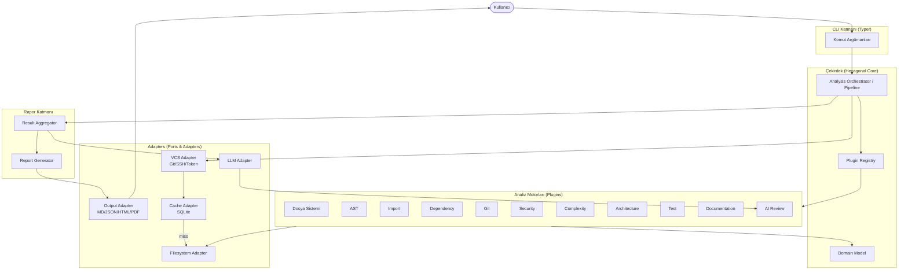

### 1.3 Arka Planda Gerçekleşen Adımlar

Kullanıcı `analyze <repo-url>` komutunu verdiğinde arka planda şu adımlar sırasıyla gerçekleşir:

| Adım | Aşama | Sorumlu Modül | Açıklama |
|------|-------|---------------|----------|
| 1 | **Komut Parse** | CLI | Argümanlar, flag'ler ve config çözülür. |
| 2 | **Repo Resolve** | VCS Adapter | URL parse edilir; public/private/SSH/token tespiti yapılır. |
| 3 | **Cache Lookup** | Cache Service | `repo_url + commit_sha` hash'i ile cache kontrolü. Hit → Adım 6'ya atla. |
| 4 | **Clone / Fetch** | Clone Service | Güvenli klonlama; credential yönetimi; geçici dizin. |
| 5 | **Cache Store** | Cache Service | Klonlanan içerik + metadata SQLite'a kaydedilir. |
| 6 | **Language Detect** | Language Detector | Dosya uzantıları + içerik tespiti ile dil dağılımı. |
| 7 | **Manifest Scan** | Scanner | `package.json`, `requirements.txt`, `go.mod` vb. manifest dosyaları taranır. |
| 8 | **Analyzer Pipeline** | Orchestrator | Plugin'ler paralel çalıştırılır (I/O-bound → async; CPU-bound → process pool). |
| 9 | **Aggregation** | Result Aggregator | Tüm bulgular birleştirilir, dedup edilir, skorlanır. |
| 10 | **AI Synthesis** | AI Review Engine | Context oluşturulur, LLM'e gönderilir, yorum üretilir. |
| 11 | **Health Score** | Metrics Engine | Ağırlıklı skor hesaplanır (güvenlik, kalite, mimari, test). |
| 12 | **Report Gen** | Report Generator | İstenen formatlarda çıktı üretilir. |
| 13 | **Cleanup** | Clone Service | Geçici dosyalar silinir (config'e bağlı). |
| 14 | **Exit** | CLI | Çıkış kodu (0=temiz, 1=bulgu, 2=hata). |

### 1.4 Repository İndirme Stratejisi

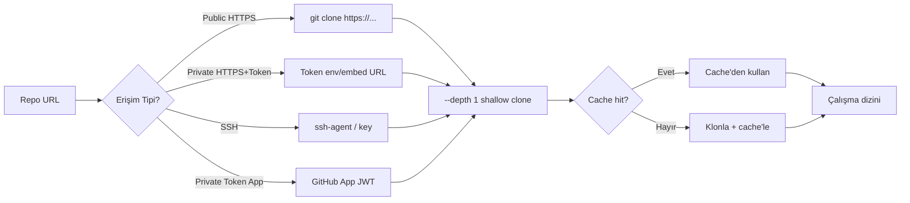

**Klonlama optimizasyonları**:
- **Shallow clone** (`--depth 1`): Varsayılan. Git geçmişi analiz edilmedikçe tam klon yapılmaz.
- **Partial clone** (`--filter=blob:none`): Büyük repolar için blob'lar lazy yüklenir.
- **Sparse checkout**: Yalnızca `src/`, `lib/` gibi dizinler gerekirse çekilir.
- **Submodule kontrolü**: `--recurse-submodules` config'e bağlı.

### 1.5 Analiz Sırası

Analiz **fazlara** ayrılır; her faz bir öncekinin çıktısına bağımlı olabilir, ancak faz içi motorlar paralel çalışır:

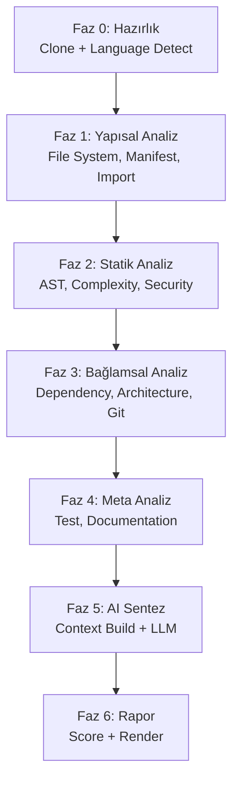

### 1.6 Sonuç Üretimi

Sonuç, **katmanlı bir rapor nesnesi** olarak üretilir:

1. **Raw Findings**: Her analiz motorunun ham bulguları.
2. **Normalized Findings**: Ortak `Finding` şemasına dönüştürülmüş bulgular.
3. **Aggregated Report**: Tüm bulguların birleştirildiği, dedup edilen rapor.
4. **AI-Enriched Report**: AI yorumları ve önerilerle zenginleştirilmiş rapor.
5. **Rendered Output**: Hedef formata (MD/JSON/HTML/PDF) dönüştürülmüş nihai çıktı.

---

## 2. Mimari Desenlerin Değerlendirilmesi

Proje için sekiz mimari desen değerlendirilmiştir. Her biri avantaj/dezavantaj tablosuyla analiz edilmiş, ardından nihai seçim yapılmıştır.

### 2.1 Değerlendirme Matrisi

| Desen | Genişletilebilirlik | Test Edilebilirlik | Karmaşıklık | CLI Uyumu | Plugin Uyumu | Toplam Skor |
|-------|:---:|:---:|:---:|:---:|:---:|:---:|
| Clean Architecture | ★★★★★ | ★★★★★ | ★★★★ | ★★★★ | ★★★★ | 22/25 |
| Hexagonal (Ports & Adapters) | ★★★★★ | ★★★★★ | ★★★ | ★★★★★ | ★★★★★ | 23/25 |
| Onion | ★★★★ | ★★★★ | ★★★★ | ★★★ | ★★★★ | 19/25 |
| Layered (n-tier) | ★★ | ★★★ | ★★ | ★★★ | ★★ | 12/25 |
| Modular Monolith | ★★★★ | ★★★★ | ★★★ | ★★★★★ | ★★★★ | 20/25 |
| Plugin Architecture | ★★★★★ | ★★★ | ★★★ | ★★★★ | ★★★★★ | 20/25 |
| Event-Driven | ★★★★ | ★★ | ★★★★★ | ★★ | ★★★★ | 15/25 |
| DDD | ★★★★ | ★★★★ | ★★★★★ | ★★★ | ★★★ | 16/25 |

### 2.2 Desen Bazlı Analiz

#### 2.2.1 Clean Architecture

| Kriter | Değerlendirme |
|--------|---------------|
| **Avantajlar** | Bağımlılıklar içe doğrudur; çekirdek framework'lere bağımlı değildir; mükemmel test edilebilirlik. |
| **Dezavantajlar** | CLI araçları için aşırı katman overhead'i; basit işlemler için çok fazla indirection. |
| **Uygunluk** | Kısmen uygun; ama tek başına plugin sistemini doğrudan modellemez. |

#### 2.2.2 Hexagonal Architecture (Ports & Adapters)

| Kriter | Değerlendirme |
|--------|---------------|
| **Avantajlar** | Adapters (VCS, LLM, Output, Cache) değiştirilebilir; çekirdek pure; test'te adapter'lar mock'lanır; plugin sistemi doğal biçimde "secondary port" olarak modellenir. |
| **Dezavantajlar** | Port sayısı arttıkça interface kalabalığı; küçük projelerde over-engineering. |
| **Uygunluk** | **Çok uygun** — projenin doğası çoklu adapter (farklı VCS, farklı LLM, farklı output) gerektirir. |

#### 2.2.3 Onion Architecture

| Kriter | Değerlendirme |
|--------|---------------|
| **Avantajlar** | Clean Architecture'a benzer; dairesel bağımlılık katmanları net. |
| **Dezavantajlar** | Hexagonal kadar adapter-merkezli değil; CLI için ekstra fayda sınırlı. |
| **Uygunluk** | Uygun ama Hexagonal'in sunduğu adapter esnekliğini tam sağlamaz. |

#### 2.2.4 Layered (n-tier)

| Kriter | Değerlendirme |
|--------|---------------|
| **Avantajlar** | Basit, tanıdık; küçük projeler için hızlı. |
| **Dezavantajlar** | Katmanlar arası sıkı bağımlılık; genişletilebilirlik zayıf; plugin sistemi zor. |
| **Uygunluk** | **Uygun değil** — bu proje için çok katı ve esneklik sunmaz. |

#### 2.2.5 Modular Monolith

| Kriter | Değerlendirme |
|--------|---------------|
| **Avantajlar** | Modüller arasında net sınır; tek process (CLI için ideal); dağıtım kolaylığı. |
| **Dezavantajlar** | Modüller arası bağımlılık disiplini gerekir; runtime isolation yok. |
| **Uygunluk** | **Uygun** — organizasyonel seviyede modüller net ayrılır. |

#### 2.2.6 Plugin Architecture

| Kriter | Değerlendirme |
|--------|---------------|
| **Avantajlar** | Yeni analiz motorları runtime'da eklenebilir; üçüncü parti genişletme; açık/kapalı prensibi (OCP). |
| **Dezavantajlar** | Plugin lifecycle yönetimi karmaşık; güvenlik (plugin güvenilir mi?); versiyon uyumluluğu. |
| **Uygunluk** | **Çok uygun** — proje gereksinimleri açıkça "gelecekte yeni analiz motorları eklenebilmeli" diyor. |

#### 2.2.7 Event-Driven

| Kriter | Değerlendirme |
|--------|---------------|
| **Avantajlar** | Asenkron, loosely coupled; ölçeklenebilir. |
| **Dezavantajlar** | CLI için overkill; event flow takibi zor; debug karmaşık; determinist test zor. |
| **Uygunluk** | **Uygun değil** — tek-process CLI için gereksiz karmaşıklık. |

#### 2.2.8 Domain-Driven Design (DDD)

| Kriter | Değerlendirme |
|--------|---------------|
| **Avantajlar** | Zengin domain model; ubiquitous language; aggregate boundary'leri net. |
| **Dezavantajlar** | Bu proje "domain" daha çok "teknik analiz" olduğu için DDD'nin stratejik kısmı (bounded context) az fayda sağlar; tactical pattern'ler (Entity, VO) yeterli. |
| **Uygunluk** | Kısmen — tactical DDD kullanılır, stratejik DDD fazla. |

### 2.3 Nihai Seçim ve Gerekçe

> **ADR-001: Mimari Desen Seçimi**
>
> **Karar**: **Hexagonal Architecture (Ports & Adapters)** çekirdek + **Plugin Architecture** genişletme modeli + **Modular Monolith** organizasyonel yapı.

**Seçim Gerekçeleri**:

1. **Çoklu Adapter İhtiyacı**: Proje dört farklı VCS erişim yöntemi (public/private/SSH/token), çoklu LLM sağlayıcı ve dört farklı çıktı formatı gerektirir. Hexagonal mimari, her birini bir "adapter" olarak modelleyerek bağımsız değiştirilebilirlik sağlar.

2. **Plugin Sistemi Doğal Uyum**: Her analiz motoru, Hexagonal'in "secondary port" (`AnalyzerPort`) interfaces'inin bir "adapter"ıdır. Plugin mimarisi bu kavramla kusursuz bütünleşir.

3. **Test Edilebilirlik**: Adapter'lar (git, LLM, filesystem) mock'lanabilir; çekirdek (orchestrator, domain) pure unit test edilebilir. CI'da ağ erişimi olmadan test koşulabilir.

4. **CLI Uyumu**: Modular Monolith organizasyonu, tek-process CLI için ideal dağıtım modelidir. Event-driven'ın karmaşıklığına gerek yok.

5. **Trade-off Kabulü**: Port/adapter interface sayısının artması kabul edilebilir bir maliyet; esneklik ve test edilebilirlik kazancı bunu telafi eder.

---

## 3. Modül Tasarımı

Proje, **tek sorumluluk prensibi (SRP)** gözetilerek modüllere ayrılır. Her modül bir "internal package" olarak tasarlanır; dışa açık API'si sınırlıdır.

### 3.1 Modül Bağımlılık Diyagramı

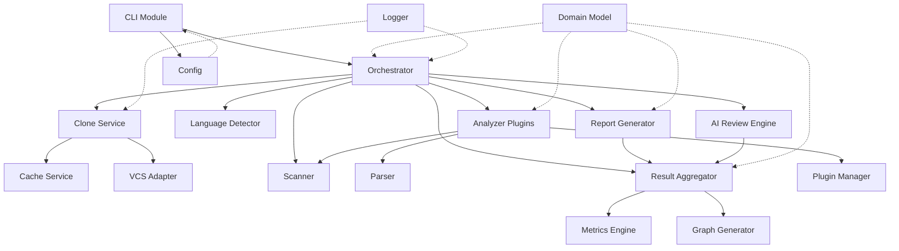

> Not: Kesikli çizgiler (domain, config, logger) tüm modüllerce kullanılan "cross-cutting" modülleri gösterir.

### 3.2 Modül Detayları

#### 3.2.1 CLI Module

| Özellik | Açıklama |
|---------|----------|
| **Görevi** | Kullanıcı komutlarını parse etmek, config'i yüklemek, orchestrator'ı başlatmak. |
| **Sorumluluğu** | Argüman doğrulama, help/error mesajları, çıkış kodları. |
| **İlişkileri** | `Orchestrator`, `Config`, `Logger`. |
| **Bağımlılıkları** | Typer (CLI framework), Rich (terminal UI). |
| **Giriş** | `argv` (komut satırı argümanları). |
| **Çıkış** | Exit code + terminal çıktısı. |

#### 3.2.2 Orchestrator (Pipeline)

| Özellik | Açıklama |
|---------|----------|
| **Görevi** | Analiz pipeline'ını koordine etmek; faz sıralamasını yönetmek. |
| **Sorumluluğu** | Faz bağımlılıklarını yönet, paralel çalıştırmayı orkestre et, hata yalıtımı. |
| **İlişkileri** | Tüm servisleri çağırır; `Plugin Manager` ile plugin keşfi. |
| **Bağımlılıkları** | `Domain Model`, `Config`, `Logger`. |
| **Giriş** | `AnalysisRequest` (repo URL, config, flags). |
| **Çıkış** | `AnalysisResult` (tüm bulgular + AI review + score). |

#### 3.2.3 Clone Service

| Özellik | Açıklama |
|---------|----------|
| **Görevi** | Repoyu güvenli şekilde klonlamak/fetch etmek; geçici dizin yönetimi. |
| **Sorumluluğu** | Credential yönetimi, shallow/partial clone stratejisi, cleanup. |
| **İlişkileri** | `VCS Adapter`, `Cache Service`, `Logger`. |
| **Bağımlılıkları** | Git CLI veya Dulwich (pure Python git), `keyring`. |
| **Giriş** | `RepoRef` (URL, erişim tipi, credential). |
| **Çıkış** | `Workspace` (klonlanan dizin yolu + metadata). |

#### 3.2.4 Cache Service

| Özellik | Açıklama |
|---------|----------|
| **Görevi** | Klonlanan repoları ve analiz sonuçlarını cache'lemek. |
| **Sorumluluğu** | Cache key hesaplama, hit/miss, expiration, LRU eviction. |
| **İlişkileri** | `Clone Service`, `Orchestrator`. |
| **Bağımlılıkları** | SQLite. |
| **Giriş** | `CacheKey` (repo hash + commit SHA). |
| **Çıkış** | `CacheEntry` veya `None`. |

> Detay için [Bölüm 9](#9-cache-mimarisi).

#### 3.2.5 Repository Service (VCS Adapter)

| Özellik | Açıklama |
|---------|----------|
| **Görevi** | VCS'e özgü işlemleri soyutlamak (git komutları, GitHub API). |
| **Sorumluluğu** | Clone, fetch, log, blame, branch listeleme. |
| **İlişkileri** | `Clone Service`, `Git Analyzer`. |
| **Bağımlılıkları** | Git binary / Dulwich / PyGithub. |
| **Giriş** | VCS tipi + credential. |
| **Çıkış** | Git operasyon sonucu. |

#### 3.2.6 Scanner

| Özellik | Açıklama |
|---------|----------|
| **Görevi** | Filesystem'i tarayıp dosya envanteri ve manifest'leri toplamak. |
| **Sorumluluğu** | Dizin traversali, `.gitignore` desteği, manifest dosya tespiti. |
| **İlişkileri** | `Language Detector`, `Parser`. |
| **Bağımlılıkları** | `pathspec` (gitignore), `pathlib`. |
| **Giriş** | `Workspace` (dizin yolu). |
| **Çıkış** | `FileInventory` (dosya listesi + tipleri). |

#### 3.2.7 Parser

| Özellik | Açıklama |
|---------|----------|
| **Görevi** | Kaynak dosyaları AST'ye dönüştürmek (dile göre). |
| **Sorumluluğu** | Dil bazlı parser seçimi, AST üretimi, syntax error toleransı. |
| **İlişkileri** | `AST Analyzer`, `Import Analyzer`, `Complexity Analyzer`. |
| **Bağımlılıkları** | Tree-sitter (çok dilli AST), dil bazlı fallback. |
| **Giriş** | Kaynak dosya içeriği + dil. |
| **Çıkış** | `AST` (Tree-sitter node tree). |

#### 3.2.8 Language Detector

| Özellik | Açıklama |
|---------|----------|
| **Görevi** | Repodaki dil dağılımını tespit etmek. |
| **Sorumluluğu** | Uzantı + içerik + shebang bazlı tespit; LOC sayımı. |
| **İlişkileri** | `Scanner`. |
| **Bağımlılıkları** | Linguist kuralları (GitHub), dosya uzantı veritabanı. |
| **Giriş** | `FileInventory`. |
| **Çıkış** | `LanguageDistribution` (dil → yüzdelik + LOC). |

#### 3.2.9 Dependency Analyzer

| Özellik | Açıklama |
|---------|----------|
| **Görevi** | Bağımlılıkları tespit etmek, versiyon ve lisans analizi. |
| **Sorumluluğu** | Manifest parse, versiyon çözümleme, güvenlik advisory kontrolü. |
| **İlişkileri** | `Security Analyzer`. |
| **Bağımlılıkları** | `pip-audit`, `npm audit`, `safety`, OSV database. |
| **Giriş** | `FileInventory` + manifest dosyaları. |
| **Çıkış** | `DependencyGraph` + `DependencyFinding[]`. |

#### 3.2.10 Security Analyzer

| Özellik | Açıklama |
|---------|----------|
| **Görevi** | Güvenlik açıklarını tespit etmek. |
| **Sorumluluğu** | SAST (statik), secret tespiti, hardcoded credential, dangerous function çağrısı. |
| **İlişkileri** | `Dependency Analyzer`, `AST Analyzer`. |
| **Bağımlılıkları** | Semgrep, Bandit (Python), TruffleHog (secret), kendi regex kuralları. |
| **Giriş** | `AST`, kaynak dosyalar. |
| **Çıkış** | `SecurityFinding[]` (severity + location + fix suggestion). |

#### 3.2.11 Architecture Analyzer

| Özellik | Açıklama |
|---------|----------|
| **Görevi** | Mimari kaliteyi incelemek. |
| **Sorumluluğu** | Layer violation, circular dependency, coupling/cohesion, design pattern tespiti. |
| **İlişkileri** | `Import Analyzer`, `Graph Generator`. |
| **Bağımlılıkları** | `networkx` (graf analizi), kendi heuristikleri. |
| **Giriş** | `ImportGraph`, `AST`. |
| **Çıkış** | `ArchitectureReport` (smells + diagram'lar). |

#### 3.2.12 Metrics Engine

| Özellik | Açıklama |
|---------|----------|
| **Görevi** | Kod metriklerini ve health score'u hesaplamak. |
| **Sorumluluğu** | Cyclomatic complexity, cognitive complexity, maintainability index, halstead; ağırlıklı sağlık skoru. |
| **İlişkileri** | `Result Aggregator`. |
| **Bağımlılıkları** | `radon` (Python), kendi hesaplamaları. |
| **Giriş** | Tüm bulgular + metrikler. |
| **Çıkış** | `HealthScore` + `Metric[]`. |

#### 3.2.13 AI Review Engine

| Özellik | Açıklama |
|---------|----------|
| **Görevi** | Bulguları sentezleyip AI tabanlı teknik yorum üretmek. |
| **Sorumluluğu** | Context oluşturma, chunking, prompt mühendisliği, token optimizasyonu. |
| **İlişkileri** | `Result Aggregator`, `LLM Adapter`. |
| **Bağımlılıkları** | z-ai-web-dev-sdk / OpenAI / Anthropic adapter. |
| **Giriş** | `AggregatedReport`. |
| **Çıkış** | `AIReview` (özet + kritik bulgular + öneriler). |

> Detay için [Bölüm 16](#16-ai-entegrasyonu).

#### 3.2.14 Report Generator

| Özellik | Açıklama |
|---------|----------|
| **Görevi** | Nihai raporu çoklu formatlarda üretmek. |
| **Sorumluluğu** | Format bazlı render, şablon yönetimi, grafik gömme. |
| **İlişkileri** | `Result Aggregator`, `Graph Generator`, `Output Adapter`. |
| **Bağımlılıkları** | Jinja2 (şablon), `weasyprint` (PDF), `markdown`. |
| **Giriş** | `AIEnrichedReport` + grafikler. |
| **Çıkış** | Markdown / JSON / HTML / PDF dosyaları. |

> Detay için [Bölüm 15](#15-rapor-mimarisi).

#### 3.2.15 Graph Generator

| Özellik | Açıklama |
|---------|----------|
| **Görevi** | Mimari ve bağımlılık grafiklerini üretmek. |
| **Sorumluluğu** | Dependency graph, module dependency, class diagram'lar. |
| **İlişkileri** | `Architecture Analyzer`, `Report Generator`. |
| **Bağımlılıkları** | `networkx`, Graphviz / Mermaid render. |
| **Giriş** | `ImportGraph`, `DependencyGraph`. |
| **Çıkış** | Gömülü Mermaid / SVG / PNG. |

#### 3.2.16 Logger

| Özellik | Açıklama |
|---------|----------|
| **Görevi** | Yapılandırılmış log üretmek. |
| **Sorumluluğu** | Seviye yönetimi, format, hedef (console/file). |
| **İlişkileri** | Cross-cutting (tüm modüller). |
| **Bağımlılıkları** | `structlog` veya `logging` + Rich handler. |
| **Giriş** | Log event'leri. |
| **Çıkış** | Formatlanmış log kayıtları. |

> Detay için [Bölüm 12](#12-logging-stratejisi).

#### 3.2.17 Config

| Özellik | Açıklama |
|---------|----------|
| **Görevi** | Yapılandırma kaynaklarını birleştirmek. |
| **Sorumluluğu** | Öncelik çözümleme, doğrulama, varsayılanlar. |
| **İlişkileri** | `CLI`. |
| **Bağımlılıkları** | `pydantic`, `pydantic-settings`, YAML. |
| **Giriş** | `config.yaml` + env + CLI args. |
| **Çıkış** | Doğrulanmış `Settings` nesnesi. |

> Detay için [Bölüm 10](#10-config-mimarisi).

#### 3.2.18 Plugin Manager

| Özellik | Açıklama |
|---------|----------|
| **Görevi** | Plugin'leri keşfetmek, yüklemek, lifecycle yönetmek. |
| **Sorumluluğu** | Entry point tarama, izolasyon, versiyon kontrolü. |
| **İlişkileri** | `Orchestrator`, `Analyzer Plugins`. |
| **Bağımlılıkları** | `importlib.metadata`, `pluggy`. |
| **Giriş** | Plugin konfigürasyonu. |
| **Çıkış** | Kayıtlı `Analyzer` instance'ları. |

> Detay için [Bölüm 8](#8-plugin-sistemi).

---

## 4. Klasör Yapısı

Aşağıdaki klasör yapısı **Hexagonal + Modular Monolith** mimarisini yansıtır. Her dizinin neden var olduğu açıklanmıştır.

```
github-repo-analyzer/
├── pyproject.toml                  # Proje metadata, bağımlılıklar, build config
├── README.md                       # Proje tanıtımı
├── LICENSE
├── CHANGELOG.md                    # Sürüm değişiklikleri (Keep a Changelog)
├── Makefile                        # Yaygın komut kısayolları
│
├── docs/                           # Dokümantasyon
│   ├── SDD.md                      # Bu doküman
│   ├── ADR/                        # Architecture Decision Records
│   │   ├── 0001-architecture-pattern.md
│   │   ├── 0002-plugin-system.md
│   │   ├── 0003-cache-strategy.md
│   │   └── 0004-llm-provider.md
│   ├── architecture/              # Mimari diyagramlar
│   └── api/                        # Plugin API referansı
│
├── src/
│   └── github_repo_analyzer/       # Ana paket
│       ├── __init__.py             # Sürüm, public API
│       ├── __main__.py             # `python -m` entry
│       │
│       ├── cli/                    # CLI katmanı (driving adapter)
│       │   ├── __init__.py
│       │   ├── app.py              # Typer uygulaması, komut tanımları
│       │   ├── commands/           # Her komut ayrı dosyada
│       │   │   ├── analyze.py
│       │   │   ├── cache.py
│       │   │   ├── config.py
│       │   │   └── plugins.py
│       │   ├── formatters/         # Terminal çıktı formatları (Rich)
│       │   │   ├── progress.py
│       │   │   └── table.py
│       │   └── exit_codes.py       # Standart çıkış kodları
│       │
│       ├── core/                   # HEXAGONAL CORE — framework bağımsız
│       │   ├── __init__.py
│       │   ├── domain/             # Domain model (Entity, VO)
│       │   │   ├── repository.py
│       │   │   ├── finding.py
│       │   │   ├── metric.py
│       │   │   ├── language.py
│       │   │   ├── dependency.py
│       │   │   ├── architecture.py
│       │   │   ├── report.py
│       │   │   ├── health_score.py
│       │   │   ├── ai_review.py
│       │   │   ├── cache_entry.py
│       │   │   └── plugin.py
│       │   ├── ports/              # Interface tanımları (abstract)
│       │   │   ├── vcs_port.py
│       │   │   ├── analyzer_port.py
│       │   │   ├── llm_port.py
│       │   │   ├── output_port.py
│       │   │   ├── cache_port.py
│       │   │   └── logger_port.py
│       │   ├── orchestrator.py     # Pipeline koordinasyonu
│       │   ├── pipeline.py         # Faz tanımları
│       │   └── result_aggregator.py
│       │
│       ├── adapters/               # ADAPTERS — port implementasyonları
│       │   ├── __init__.py
│       │   ├── vcs/                # VCS adapter'ları
│       │   │   ├── git_cli.py      # git binary tabanlı
│       │   │   ├── git_dulwich.py  # pure Python fallback
│       │   │   └── github_api.py   # GitHub REST/GraphQL
│       │   ├── llm/                # LLM adapter'ları
│       │   │   ├── zai.py          # z-ai-web-dev-sdk
│       │   │   ├── openai.py
│       │   │   └── anthropic.py
│       │   ├── output/             # Output format adapter'ları
│       │   │   ├── markdown.py
│       │   │   ├── json_out.py
│       │   │   ├── html.py
│       │   │   └── pdf.py
│       │   └── cache/              # Cache adapter'ları
│       │       ├── sqlite_cache.py
│       │       └── fs_cache.py
│       │
│       ├── analyzers/              # Yerleşik analiz motorları (plugin'ler)
│       │   ├── __init__.py
│       │   ├── base.py             # BaseAnalyzer abstract
│       │   ├── filesystem/
│       │   │   ├── __init__.py
│       │   │   └── analyzer.py
│       │   ├── ast/
│       │   │   ├── __init__.py
│       │   │   ├── analyzer.py
│       │   │   └── tree_sitter_loader.py
│       │   ├── imports/
│       │   │   └── analyzer.py
│       │   ├── dependency/
│       │   │   ├── analyzer.py
│       │   │   └── manifests/      # Dil bazlı manifest parser
│       │   │       ├── python.py
│       │   │       ├── nodejs.py
│       │   │       ├── go.py
│       │   │       └── rust.py
│       │   ├── git_history/
│       │   │   └── analyzer.py
│       │   ├── security/
│       │   │   ├── analyzer.py
│       │   │   ├── sast.py
│       │   │   ├── secret_scan.py
│       │   │   └── rules/          # Özel kural setleri
│       │   ├── complexity/
│       │   │   └── analyzer.py
│       │   ├── architecture/
│       │   │   ├── analyzer.py
│       │   │   ├── layer_detector.py
│       │   │   └── cycle_detector.py
│       │   ├── test_coverage/
│       │   │   └── analyzer.py
│       │   ├── documentation/
│       │   │   └── analyzer.py
│       │   └── ai_review/
│       │       └── analyzer.py
│       │
│       ├── plugins/                # Plugin yönetimi
│       │   ├── __init__.py
│       │   ├── manager.py          # PluginManager
│       │   ├── registry.py         # Kayıt defteri
│       │   ├── lifecycle.py        # Plugin lifecycle hooks
│       │   └── sandbox.py          # Plugin izolasyonu
│       │
│       ├── reports/                # Rapor üretim katmanı
│       │   ├── __init__.py
│       │   ├── generator.py        # ReportGenerator
│       │   ├── templates/          # Jinja2 şablonları
│       │   │   ├── markdown/
│       │   │   ├── html/
│       │   │   └── pdf/
│       │   └── graphs/             # GraphGenerator
│       │       ├── dependency.py
│       │       └── architecture.py
│       │
│       ├── infrastructure/         # Cross-cutting altyapı
│       │   ├── __init__.py
│       │   ├── config/             # Config yönetimi
│       │   │   ├── settings.py     # Pydantic Settings
│       │   │   ├── defaults.py
│       │   │   └── schema.py       # config.yaml şeması
│       │   ├── logging/            # Logging altyapısı
│       │   │   ├── setup.py
│       │   │   ├── formatters.py
│       │   │   └── handlers.py
│       │   ├── errors/             # Exception hiyerarşisi
│       │   │   ├── base.py
│       │   │   ├── vcs.py
│       │   │   ├── analyzer.py
│       │   │   └── llm.py
│       │   ├── concurrency/        # Paralel çalışma
│       │   │   ├── executor.py
│       │   │   └── pool.py
│       │   └── security/           # Credential yönetimi
│       │       ├── keyring_store.py
│       │       └── temp_files.py
│       │
│       └── utils/                  # Yardımcı fonksiyonlar
│           ├── __init__.py
│           ├── hashing.py
│           ├── filesystem.py
│           ├── timing.py
│           └── text.py
│
├── tests/                          # Test paketi (src dışında)
│   ├── conftest.py                 # Pytest fixture'ları
│   ├── unit/
│   │   ├── core/
│   │   ├── adapters/
│   │   └── analyzers/
│   ├── integration/
│   │   ├── test_pipeline.py
│   │   └── test_cache.py
│   ├── e2e/
│   │   └── test_full_analysis.py
│   ├── golden/                     # Golden test sabitleri
│   │   └── fixtures/
│   ├── fixtures/                   # Test repo klonları
│   │   ├── tiny_repo/
│   │   └── vulnerable_repo/
│   └── snapshots/                  # Snapshot test çıktıları
│
├── examples/                       # Örnek kullanım senaryoları
│   ├── config.example.yaml
│   └── plugins/                    # Örnek plugin
│       └── custom_analyzer/
│
└── scripts/                        # Geliştirme script'leri
    ├── benchmark.py                # Performans benchmark
    └── seed_cache.py
```

### 4.1 Klasör Sorumluluk Özeti

| Klasör | Neden Var? | Sorumluluk |
|--------|-----------|------------|
| `cli/` | Kullanıcı giriş noktası; driving adapter | Komut parse, terminal UI, çıkış kodları |
| `core/` | Hexagonal çekirdek; framework bağımsız | Domain model, port tanımları, orchestrator |
| `core/domain/` | İş varlıkları | Entity, Value Object |
| `core/ports/` | Soyut interface'ler | Adapter'ların uygulayacağı kontratlar |
| `adapters/` | Port implementasyonları | VCS, LLM, output, cache somut sınıfları |
| `analyzers/` | Yerleşik analiz motorları | Her motor bir plugin olarak |
| `plugins/` | Plugin yönetim altyapısı | Keşif, kayıt, lifecycle |
| `reports/` | Rapor üretim katmanı | Şablon, render, grafik |
| `infrastructure/` | Cross-cutting konsernler | Config, logging, error, concurrency, security |
| `utils/` | Saf yardımcı fonksiyonlar | Hash, filesystem, timing |
| `tests/` | Test organizasyonu | Unit/integration/e2e/golden ayrımı |
| `docs/` | Dokümantasyon | SDD, ADR, API referansı |

---

## 5. Veri Akışı

Bu bölüm, repo URL'sinden nihai rapora kadar olan **nesne ve servis akışını** adım adım gösterir.

### 5.1 Sequence Diagram: Tam Analiz Akışı

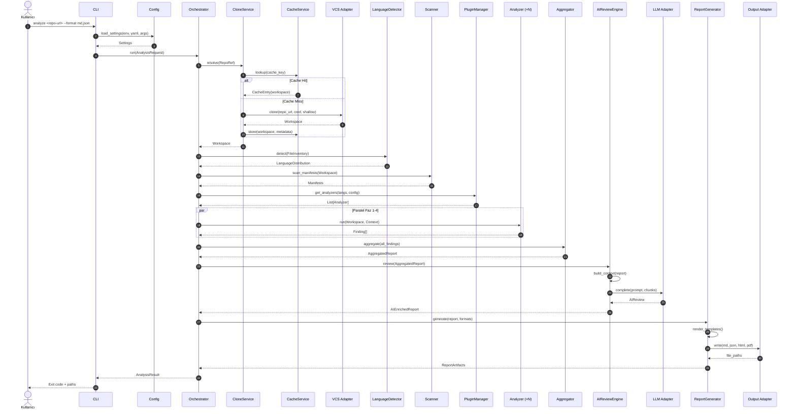

### 5.2 Oluşan Nesneler ve Sıra

| Adım | Oluşan Nesne | Üreten Servis | Tüketen Servis |
|------|-------------|---------------|----------------|
| 1 | `AnalysisRequest` | CLI | Orchestrator |
| 2 | `Settings` | Config | Tüm modüller |
| 3 | `RepoRef` | Orchestrator | CloneService |
| 4 | `CacheKey` | CloneService | CacheService |
| 5 | `Workspace` | VCS Adapter | Scanner, Analyzers |
| 6 | `FileInventory` | Scanner | LanguageDetector |
| 7 | `LanguageDistribution` | LanguageDetector | Orchestrator |
| 8 | `ManifestCollection` | Scanner | DependencyAnalyzer |
| 9 | `AnalyzerContext` | Orchestrator | Her Analyzer |
| 10 | `Finding[]` | Her Analyzer | Aggregator |
| 11 | `AggregatedReport` | Aggregator | AIReviewEngine |
| 12 | `LLMContext` | AIReviewEngine | LLM Adapter |
| 13 | `AIReview` | LLM Adapter | ReportGenerator |
| 14 | `AIEnrichedReport` | AIReviewEngine | ReportGenerator |
| 15 | `ReportArtifacts` | ReportGenerator | CLI |

### 5.3 Veri Akış Diyagramı (DFD Mantığında)

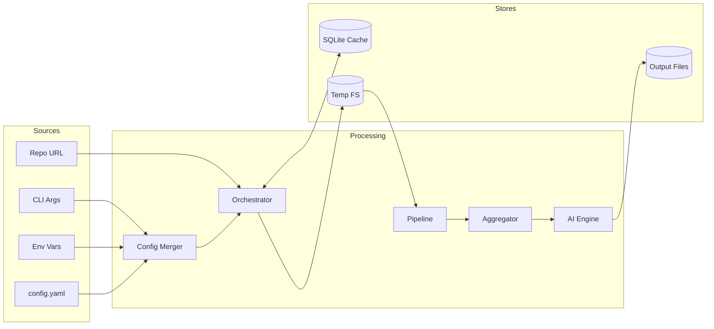

### 5.4 Kısa Senaryo: Cache Hit Durumu

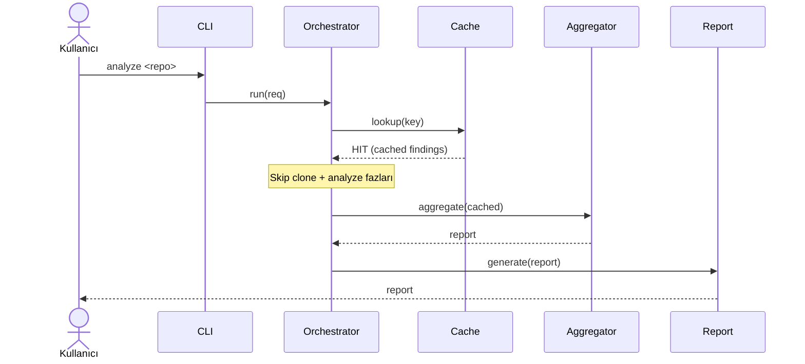

Cache hit durumunda **clone, dil tespiti ve tüm analiz fazları atlanır**; yalnızca rapor üretimi yeniden çalışır (format değişikliği için).

---

## 6. Domain Model

Sistem, **tactical DDD** prensipleriyle modellenmiş bir domain katmanına sahiptir. Aşağıda her model, alanları, tipleri ve ilişkileri tanımlanmıştır.

### 6.1 Domain Sınıf Diyagramı

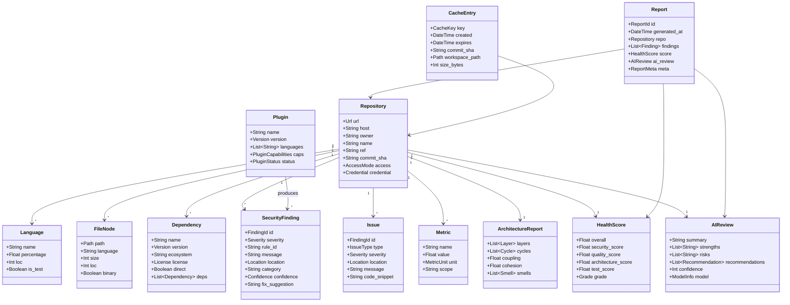

### 6.2 Model Detayları

#### 6.2.1 Repository (Aggregate Root)

| Alan | Tip | Açıklama |
|------|-----|----------|
| `url` | `Url` (VO) | Tam repo URL'i. |
| `host` | `String` | `github.com`, `gitlab.com` vb. |
| `owner` | `String` | Repo sahibi (org/user). |
| `name` | `String` | Repo adı. |
| `ref` | `String` | Branch/tag/commit. |
| `commit_sha` | `String` | Analiz edilen commit. |
| `access` | `AccessMode` (Enum: PUBLIC, PRIVATE, SSH, TOKEN) | Erişim tipi. |
| `credential` | `Credential` (VO) | Token/key referansı (değer değil). |
| **İlişkiler** | — | Language, FileNode, Dependency, Finding ile 1-N. |
| **Sorumluluk** | — | Analizin kök aggregate'i; kimlik = url + commit_sha. |

#### 6.2.2 Language

| Alan | Tip | Açıklama |
|------|-----|----------|
| `name` | `String` | `Python`, `TypeScript` vb. |
| `percentage` | `Float` | LOC yüzdesi. |
| `loc` | `Int` | Toplam satır. |
| `is_test` | `Boolean` | Test kodu mu? |

#### 6.2.3 Dependency

| Alan | Tip | Açıklama |
|------|-----|----------|
| `name` | `String` | Paket adı. |
| `version` | `Version` (VO) | Semver uyumlu. |
| `ecosystem` | `String` | `pypi`, `npm`, `cargo` vb. |
| `license` | `License` (VO) | SPDX tanımlayıcı. |
| `direct` | `Boolean` | Doğrudan mı transitive mi. |
| `deps` | `List[Dependency]` | Transitive bağımlılıklar. |

#### 6.2.4 SecurityFinding

| Alan | Tip | Açıklama |
|------|-----|----------|
| `id` | `FindingId` (VO) | Deterministik hash. |
| `severity` | `Severity` (Enum: CRITICAL, HIGH, MEDIUM, LOW, INFO) | Önem. |
| `rule_id` | `String` | Kural tanımlayıcı (örn. `bandit.B101`). |
| `message` | `String` | İnsan-okur açıklama. |
| `location` | `Location` (VO: file+line+col) | Konum. |
| `category` | `String` | `sast`, `secret`, `dependency` vb. |
| `confidence` | `Confidence` (Enum) | Güven skoru. |
| `fix_suggestion` | `String?` | Önerilen düzeltme. |

#### 6.2.5 Issue (Kalite Bulgusu)

| Alan | Tip | Açıklama |
|------|-----|----------|
| `id` | `FindingId` | Deterministik. |
| `type` | `IssueType` (Enum: COMPLEXITY, DUPLICATION, DEAD_CODE, CODE_SMELL, ANTI_PATTERN) | Tip. |
| `severity` | `Severity` | Önem. |
| `location` | `Location` | Konum. |
| `message` | `String` | Açıklama. |
| `code_snippet` | `String?` | İlgili kod parçası. |

#### 6.2.6 Metric

| Alan | Tip | Açıklama |
|------|-----|----------|
| `name` | `String` | `cyclomatic_complexity`, `mi` vb. |
| `value` | `Float` | Değer. |
| `unit` | `MetricUnit` (Enum) | Birim. |
| `scope` | `String` | `file`, `module`, `function`. |

#### 6.2.7 ArchitectureReport

| Alan | Tip | Açıklama |
|------|-----|----------|
| `layers` | `List[Layer]` | Tespit edilen katmanlar. |
| `cycles` | `List[Cycle]` | Döngüsel bağımlılıklar. |
| `coupling` | `Float` | Modüller arası bağ (0-1). |
| `cohesion` | `Float` | Modül içi tutarlılık (0-1). |
| `smells` | `List[Smell]` | Mimari kokuları. |

#### 6.2.8 HealthScore

| Alan | Tip | Açıklama |
|------|-----|----------|
| `overall` | `Float` | 0-100 toplam skor. |
| `security_score` | `Float` | Güvenlik alt skoru. |
| `quality_score` | `Float` | Kod kalitesi. |
| `architecture_score` | `Float` | Mimari kalite. |
| `test_score` | `Float` | Test coverage/kalite. |
| `grade` | `Grade` (Enum: A-F) | Harf notu. |

> Skor hesabı: ağırlıklı toplam. Varsayılan ağırlıklar: güvenlik %40, kalite %25, mimari %20, test %15. (Config'ten değiştirilebilir.)

#### 6.2.9 AIReview

| Alan | Tip | Açıklama |
|------|-----|----------|
| `summary` | `String` | Özet. |
| `strengths` | `List[String]` | Güçlü yönler. |
| `risks` | `List[String]` | Riskler. |
| `recommendations` | `List[Recommendation]` | Öneriler (priority + effort). |
| `confidence` | `Int` | AI güven skoru (0-100). |
| `model` | `ModelInfo` | Kullanılan model bilgisi. |

#### 6.2.10 Report (Nihai Rapor Aggregate)

| Alan | Tip | Açıklama |
|------|-----|----------|
| `id` | `ReportId` | UUID. |
| `generated_at` | `DateTime` | Üretim zamanı. |
| `repo` | `Repository` | Kaynak repo. |
| `findings` | `List[Finding]` | Tüm bulgular (security + issue). |
| `score` | `HealthScore` | Sağlık skoru. |
| `ai_review` | `AIReview` | AI yorumu. |
| `meta` | `ReportMeta` | Versiyon, config snapshot. |

#### 6.2.11 CacheEntry

| Alan | Tip | Açıklama |
|------|-----|----------|
| `key` | `CacheKey` | Hash. |
| `created` | `DateTime` | Oluşturma. |
| `expires` | `DateTime` | Son kullanma. |
| `commit_sha` | `String` | Commit. |
| `workspace_path` | `Path` | Cache dizini. |
| `size_bytes` | `Int` | Boyut. |

#### 6.2.12 Plugin

| Alan | Tip | Açıklama |
|------|-----|----------|
| `name` | `String` | Plugin adı. |
| `version` | `Version` | Sürüm. |
| `languages` | `List[String]` | Desteklenen diller. |
| `caps` | `PluginCapabilities` | Yetenekler (flags). |
| `status` | `PluginStatus` (Enum: ENABLED, DISABLED, ERROR) | Durum. |

---

## 7. Analiz Motorları

Sistemde **on bir analiz motoru** bulunur. Her biri bir plugin olarak `AnalyzerPort` interface'ini uygular.

### 7.1 Motor Özeti

| # | Motor | Girdi | Çıktı | Faz | Tip |
|---|-------|-------|-------|-----|-----|
| 1 | Dosya Sistemi | Workspace | FileInventory | 0 | I/O-bound |
| 2 | AST | Kaynak dosyalar | AST + syntax issues | 2 | CPU-bound |
| 3 | Import | AST | ImportGraph | 1 | CPU-bound |
| 4 | Dependency | Manifest dosyaları | DependencyGraph + vulns | 3 | I/O + ağ |
| 5 | Git | Git history | Commit stats, churn | 3 | I/O-bound |
| 6 | Security | AST + kaynak + deps | SecurityFinding[] | 2 | CPU + ağ |
| 7 | Complexity | AST | Metric[] | 2 | CPU-bound |
| 8 | Architecture | ImportGraph + AST | ArchitectureReport | 3 | CPU-bound |
| 9 | Test | Test dosyaları + coverage | TestReport | 4 | CPU-bound |
| 10 | Documentation | Kaynak + docs | DocReport | 4 | I/O-bound |
| 11 | AI Review | AggregatedReport | AIReview | 5 | Ağ (LLM) |

### 7.2 Motor Detayları

#### 7.2.1 Dosya Sistemi Analizi

- **Ne yapar?** Dizin ağacını travers eder, `.gitignore` ve özel exclude kurallarını uygular, dosya envanteri oluşturur.
- **Neleri okur?** Workspace dizini, `.gitignore`, config exclude list.
- **Neleri üretir?** `FileInventory` (dosya yolu, boyut, dil tahmini, binary flag).

#### 7.2.2 AST Analizi

- **Ne yapar?** Tree-sitter ile çok dilli AST üretir; syntax error'ları toplar.
- **Neleri okur?** Kaynak dosya içerikleri (streaming).
- **Neleri üretir?** `AST` (cache'lenebilir), syntax `Issue[]`.

#### 7.2.3 Import Analizi

- **Ne yapar?** Import/require/use deyimlerini çıkarır; modül bağımlılık grafiği kurar.
- **Neleri okur?** AST.
- **Neleri üretir?** `ImportGraph` (node = modül, edge = import).

#### 7.2.4 Dependency Analizi

- **Ne yapar?** Manifest dosyalarını parse eder; doğrudan ve transitive bağımlılıkları çözer; güvenlik advisory'lerini kontrol eder.
- **Neleri okur?** `package.json`, `requirements.txt`, `go.mod`, `Cargo.toml`, `pom.xml` vb.
- **Neleri üretir?** `DependencyGraph`, `SecurityFinding[]` (dependency-based), lisans raporu.

#### 7.2.5 Git Analizi

- **Ne yapar?** Commit history, churn (sık değişen dosyalar), katkıda bulunanlar, branch yapısını analiz eder.
- **Neleri okur?** Git log, blame (shallow değilse).
- **Neleri üretir?** `GitStats` (commit count, churn, contributors, hotspots).

#### 7.2.6 Security Analizi

- **Ne yapar?** SAST (dangerous fonksiyon, injection), secret tespiti (API key, token), hardcoded credential.
- **Neleri okur?** AST, kaynak dosyalar, `.env*` dosyaları (config izin verirse).
- **Neleri üretir?** `SecurityFinding[]` (severity + location + fix).

#### 7.2.7 Complexity Analizi

- **Ne yapar?** Cyclomatic complexity, cognitive complexity, maintainability index, halstead metrikleri.
- **Neleri okur?** AST.
- **Neleri üretir?** `Metric[]` (function/module/file scope).

#### 7.2.8 Architecture Analizi

- **Ne yapar?** Layer violation, circular dependency, coupling/cohesion, god class, feature envy tespiti.
- **Neleri okur?** `ImportGraph`, AST.
- **Neleri üretir?** `ArchitectureReport` (smells + layer diagram + cycle list).

#### 7.2.9 Test Analizi

- **Ne yapar?** Test dosyalarını tespit eder, test/repo oranı, coverage (varsa), test smells.
- **Neleri okur?** Test dosyaları, coverage raporu (`coverage.xml`, `.lcov`).
- **Neleri üretir?** `TestReport` (ratio, coverage %, test smells).

#### 7.2.10 Documentation Analizi

- **Ne yapar?** Docstring/comment coverage, README kalitesi, API doc bütünlüğü.
- **Neleri okur?** Kaynak dosyalar, `README*`, `docs/`.
- **Neleri üretir?** `DocReport` (coverage %, eksik alanlar).

#### 7.2.11 AI Review Analizi

- **Ne yapar?** Tüm bulguları sentezler, LLM'e gönderir, teknik yorum ve öneriler üretir.
- **Neleri okur?** `AggregatedReport`.
- **Neleri üretir?** `AIReview`.

### 7.3 Motor Çalıştırma Grafiği

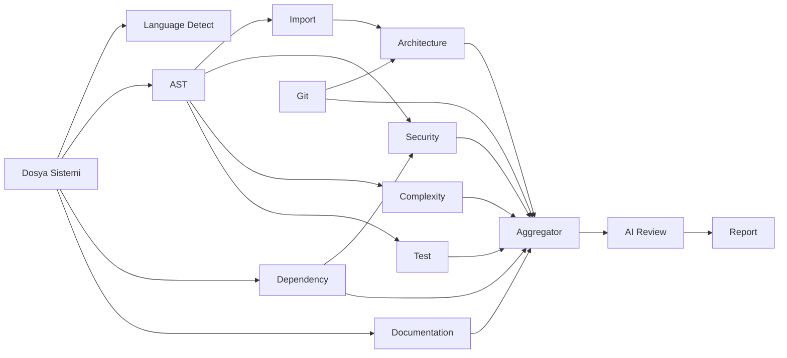

---

## 8. Plugin Sistemi

Sistem, gelecekte yeni analiz motorlarının **runtime'da** eklenebilmesi için bir plugin mimarisine sahiptir.

### 8.1 Plugin Mimarisi Diyagramı

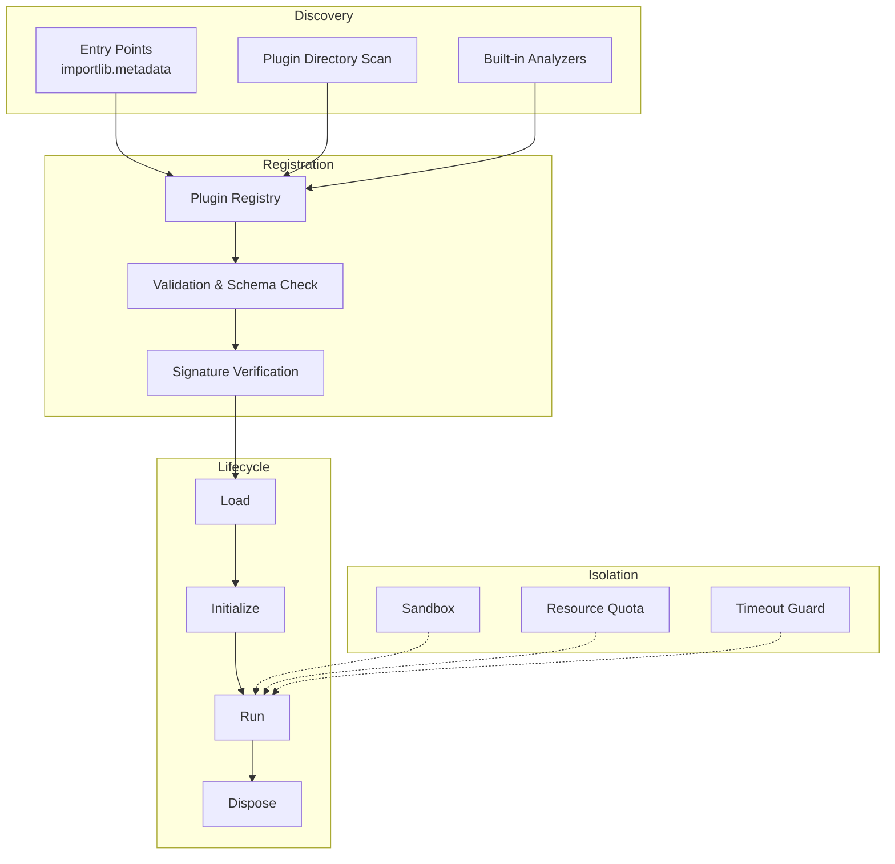

### 8.2 Plugin Interface (Port)

Her plugin, `AnalyzerPort` interface'ini uygular. Interface contract'ı (sözleşme):

| Metot | İmza | Açıklama |
|-------|------|----------|
| `metadata()` | `→ PluginMetadata` | Ad, sürüm, desteklenen diller, yetenekler. |
| `initialize(config)` | `→ None` | Plugin başlatma; kaynak hazırlığı. |
| `can_run(context)` | `→ bool` | Bu plugin bu context'te çalışabilir mi? |
| `run(context)` | `→ List[Finding]` | Asıl analiz. |
| `dispose()` | `→ None` | Cleanup. |
| `health_check()` | `→ HealthStatus` | Plugin sağlığı (örn. external servis up mı?). |

### 8.3 Plugin Yaşam Döngüsü

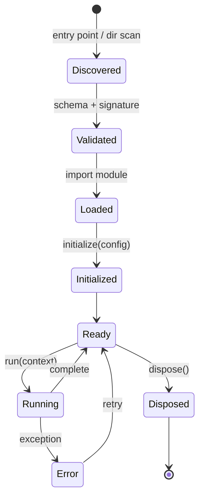

### 8.4 Plugin Kaynak Stratejileri

1. **Entry Points (PEP 621)**: `pyproject.toml`'da `[project.entry-points."gra.analyzers"]` ile; `pip install` ile gelen paketler otomatik kaydedilir. **Önerilen**.
2. **Dizin Tarama**: `~/.gra/plugins/` altındaki `.py` / `.whl` dosyaları yüklenir. Geliştirme dostu.
3. **Built-in**: `analyzers/` altındaki yerleşik motorlar her zaman kayıtlıdır.

### 8.5 Plugin Güvenliği

| Risk | Önlem |
|------|-------|
| Kötü niyetli plugin kod çalıştırma | İmza doğrulama (opt-in), güvenilir kaynak kontrolü, `--trust-plugin` flag. |
| Kaynak tüketimi (memory/CPU) | Resource quota + timeout guard. |
| Çökme tüm sistemi etkiler | Subprocess izolasyonu (opt-in `isolated: true`). |
| API uyumsuzluğu | Semver major check; plugin `api_version` alanı zorunlu. |

### 8.6 Plugin Manifest Örneği (Şema)

Her plugin bir manifest tanımlar (Python dict / dataclass):

| Alan | Tip | Zorunlu | Açıklama |
|------|-----|---------|----------|
| `name` | `String` | ✅ | Unique ad. |
| `version` | `String` | ✅ | Semver. |
| `api_version` | `String` | ✅ | Hedeflenen plugin API sürümü. |
| `languages` | `List[String]` | ❌ | Desteklenen diller (`*` = tümü). |
| `capabilities` | `List[String]` | ❌ | `sast`, `complexity` vb. |
| `phase` | `Int` | ✅ | Çalışma fazı (0-5). |
| `timeout_sec` | `Int` | ❌ | Maksimum süre. |
| `isolated` | `Bool` | ❌ | Subprocess izolasyonu. |

---

## 9. Cache Mimarisi

Aynı repo tekrar analiz edildiğinde **yeniden klonlama ve analiz** maliyetinden kaçınmak için iki katmanlı cache kullanılır.

### 9.1 Cache Stratejisi Karşılaştırması

| Strateji | Hız | Kalıcılık | Karmaşıklık | Sorgulama | Seçim |
|----------|:---:|:---:|:---:|:---:|:---:|
| Dosya sistemi (raw) | ★★★★★ | ★★★ | ★★ | ★★ | Clone cache için |
| SQLite | ★★★★ | ★★★★★ | ★★★ | ★★★★★ | Metadata + sonuç cache için |
| Redis | ★★★★★ | ★★★★ | ★★★★★ | ★★★★★ | Reddedildi (ek servis) |
| Memory-only | ★★★★★ | ★ | ★ | ★★★★ | Reddedildi (CLI kapanır) |

> **ADR-003: Cache Stratejisi** — **SQLite (metadata) + Dosya sistemi (clone)** hibrit modeli seçildi. Ek servis (Redis) gerektirmediği ve CLI için yeterli performans verdiği için.

### 9.2 Cache Mimarisi Diyagramı

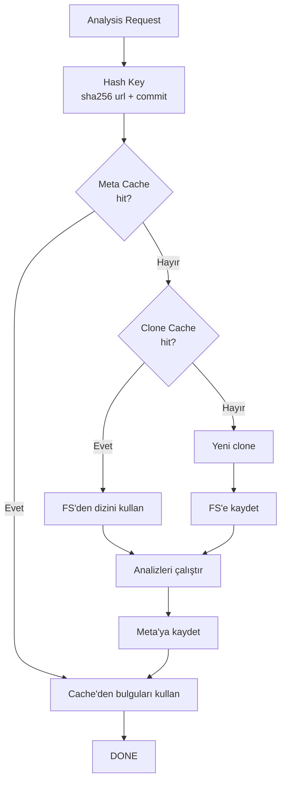

### 9.3 Cache Key Hesabı

```
cache_key = sha256(
    normalized_url + ":" + commit_sha + ":" + analyzer_version + ":" + config_hash
)
```

- `normalized_url`: `https://github.com/owner/repo` formatına normalize edilir.
- `commit_sha`: Deterministiklik için commit bazlıdır. Branch adı kullanılmaz (değişir).
- `analyzer_version`: Analyzer sürümü değişirse cache invalid olur.
- `config_hash`: Config değişirse (örn. yeni kural) cache invalid.

### 9.4 Expiration Politikası

| Katman | Expiration | Eviction |
|--------|-----------|----------|
| Clone Cache (FS) | TTL: 7 gün (varsayılan) | LRU + size limit (örn. 2 GB) |
| Meta Cache (SQLite) | TTL: 30 gün | LRU + entry limit (örn. 1000) |
| AI Review Cache | TTL: 14 gün | LRU |

Ek olarak **force-refresh** (`--no-cache`) ve **commit-değişti** invalidasyonu vardır.

### 9.5 Cache Tablo Şeması (SQLite — kavramsal)

| Tablo | Amaç | Anahtar Alanlar |
|-------|------|-----------------|
| `clone_cache` | Klonlanmış repo metadata | `cache_key`, `repo_url`, `commit_sha`, `path`, `created`, `expires`, `size` |
| `analysis_cache` | Analiz sonucu | `cache_key`, `analyzer_id`, `result_json`, `created`, `expires` |
| `ai_cache` | LLM yanıtı | `prompt_hash`, `response_json`, `created`, `expires`, `model` |
| `access_log` | Erişim logu (LRU için) | `cache_key`, `last_access` |

> Not: Bu kavramsal şemadır; uygulama detayı değil.

### 9.6 Cache Bütünlüğü

- **Checksum**: Her cache entry'nin checksum'u saklanır; bozulma tespiti.
- **Validation on load**: Load sırasında doğrulama; geçersizse miss gibi davran.
- **Atomic writes**: Geçici dosya + rename pattern (yarım yazma koruması).

---

## 10. Config Mimarisi

Yapılandırma **üç kaynaktan** gelir; belirli bir öncelik sırasıyla birleştirilir.

### 10.1 Config Öncelik Sıralaması

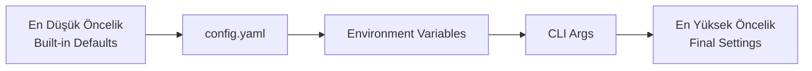

| Öncelik | Kaynak | Örnek | Notlar |
|:---:|--------|-------|--------|
| 1 | Built-in defaults | `cache.ttl_days = 7` | Kodda tanımlı. |
| 2 | `config.yaml` | `~/.gra/config.yaml` veya `--config` | Proje/repoya özel. |
| 3 | Env vars | `GRA_GITHUB_TOKEN=...` | CI/CD için ideal. |
| 4 | CLI args | `--format json --no-cache` | En yüksek; kullanıcı açık tercihi. |

### 10.2 Config Şeması (Kavramsal)

| Bölüm | Anahtarlar | Açıklama |
|-------|-----------|----------|
| `vcs` | `clone_depth`, `partial_clone`, `timeout` | Klonlama davranışı. |
| `cache` | `enabled`, `ttl_days`, `max_size_gb`, `db_path` | Cache ayarları. |
| `analyzers` | `enabled[]`, `disabled[]`, `phase_overrides` | Analyzer seçimi. |
| `security` | `severity_threshold`, `ruleset`, `secret_scan` | Güvenlik ayarları. |
| `ai` | `provider`, `model`, `max_tokens`, `temperature`, `enabled` | LLM ayarları. |
| `report` | `formats[]`, `output_dir`, `template_dir` | Rapor çıktısı. |
| `logging` | `level`, `format`, `file`, `structured` | Log ayarları. |
| `plugins` | `dirs[]`, `trusted[]`, `isolated_default` | Plugin ayarları. |
| `scoring` | `weights` | Health score ağırlıkları. |

### 10.3 Config Doğrulama

- **Pydantic Settings** ile tip güvenliği; hatalı config başlangıçta yakalanır.
- **Defaults**: Her alanın makul bir varsayanı vardır; boş config çalışır.
- **Profile desteği**: `--profile strict` gibi önceden tanımlı config preset'leri.

> **ADR-005: Config Yönetimi** — Pydantic Settings + YAML + env + CLI overlay seçildi. Tip güvenliği ve öncelik yönetimi tek noktada çözülür.

---

## 11. Error Handling Stratejisi

Profesyonel bir exception hiyerarşisi, hatanın **nerede yakalanacağını** ve **nasıl işleneceğini** belirler.

### 11.1 Exception Hiyerarşisi

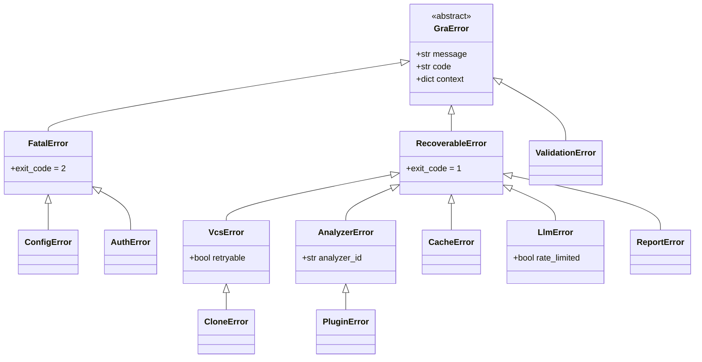

### 11.2 Hata Kategorileri

| Kategori | Tanım | Örnek | Strateji |
|----------|-------|-------|----------|
| **Fatal** | Devam edilemez; sistem durur. | Config bozuk, auth başarısız. | Kullanıcıya net mesaj + exit 2. |
| **Recoverable** | Tek motor başarısız; devam edilir. | Bir analyzer exception fırlattı. | Logla, o motoru atla, devam et. |
| **Transient** | Geçici; retry edilebilir. | Ağ timeout, LLM rate limit. | Exponential backoff retry. |
| **Validation** | Girdi hatalı. | Geçersiz URL. | Erken reddet + net mesaj. |

### 11.3 Hangi Katmanda Yakalanmalı?

| Hata | Yakalayan Katman | Strateji |
|------|------------------|----------|
| `ConfigError` | CLI (startup) | Fatal; çök. |
| `AuthError` | VCS Adapter → Clone Service | Fatal; credential ipucu ver. |
| `CloneError` (transient) | Clone Service | Retry (max 3, backoff). |
| `CloneError` (fatal) | Clone Service | Fatal. |
| `AnalyzerError` | Orchestrator | Recoverable; motoru atla, uyar. |
| `PluginError` | Plugin Manager | Recoverable; plugin'i devre dışı bırak. |
| `LlmError` (rate limited) | LLM Adapter | Retry + backoff + fallback model. |
| `LlmError` (fatal) | AI Review Engine | Recoverable; AI'sız rapor üret. |
| `CacheError` | Cache Service | Recoverable; cache'siz devam. |
| `ReportError` | Report Generator | Recoverable; formatı atla. |

### 11.4 Retry Stratejisi

| Senaryo | Max Retry | Backoff | Jitter |
|---------|:---:|---|---|
| Git clone (ağ) | 3 | Exponential (1s, 2s, 4s) | ±%20 |
| LLM rate limit | 5 | Exponential + `Retry-After` header | ±%10 |
| Dependency DB lookup | 2 | Fixed 1s | Yok |

### 11.5 Error Context Zenginleştirme

Her exception, **structured context** taşır:
- `code`: Stabil hata kodu (örn. `GRA_VCS_AUTH_001`).
- `message`: İnsan-okur.
- `context`: Dict (repo, analyzer, file, line vb.).
- `cause`: Zincirli orijinal exception.

---

## 12. Logging Stratejisi

### 12.1 Log Seviyeleri ve Kullanım

| Seviye | Kullanım | Örnek |
|--------|----------|-------|
| `TRACE` | Çok detaylı; debug için. | "AST node visited: FunctionDefinition@42" |
| `DEBUG` | Geliştirici tanısı. | "Cache miss for key abc123" |
| `INFO` | Normal akış; kullanıcıya görünür. | "Analyzing repository owner/repo@main" |
| `WARNING` | Beklenmeyen ama devam edilebilir. | "Analyzer X timed out, skipping" |
| `ERROR` | Hata; ilgili akış başarısız. | "Failed to clone: auth error" |
| `CRITICAL` | Sistem çöktü. | "Config corruption; cannot start" |

### 12.2 Log Formatı

**Yapılandırılmış (JSON)** — makine işleme için:

```json
{
  "ts": "2025-01-15T10:23:45.123Z",
  "level": "INFO",
  "event": "analyzer.run.start",
  "analyzer": "security",
  "repo": "owner/repo",
  "commit": "abc123",
  "trace_id": "req-xyz",
  "msg": "Starting security analyzer"
}
```

**İnsan-okur (Rich)** — interaktif terminal için:

```
10:23:45 INFO  ▸ security analyzer started (owner/repo@abc123)
10:23:46 WARN  ⚠ complexity analyzer timed out — skipping
10:23:50 INFO  ✓ security: 12 findings (2 HIGH)
```

### 12.3 Log Hedefleri

| Hedef | Varsayılan Seviye | Format | Ne zaman |
|-------|:---:|---|---|
| Console (Rich) | INFO | Renkli, kompakt | İnteraktif. |
| File (`~/.gra/logs/gra.log`) | DEBUG | Yapılandırılmış JSON | Kalıcı tanı. |
| File (rotated) | INFO | JSON | 10 MB / 5 dosya rotation. |

### 12.4 Structured Logging Prensibi

- **Event-based**: Her log bir olay (`event`) anahtarı taşır.
- **Trace ID**: Bir analiz isteği boyunca aynı `trace_id`; korelasyon sağlar.
- **No PII**: Credential, token, secret **asla** loglanmaz (redaction filter).
- **Sensitive path redaction**: `/home/user/.ssh/id_rsa` → `/home/REDACTED/.ssh/id_rsa`.

### 12.5 Performans

- **Async handler**: Dosya yazımı ayrı thread'de; ana akışı bloklamaz.
- **Sampling**: TRACE seviyesi %10 örneklenir (config).
- **Lazy evaluation**: `log.debug(expensive())` yerine `log.debug("msg", x=expensive())` (lazy).

---

## 13. Performans Tasarımı

100 satırlık bir repo ile 1 milyon satırlık repo arasındaki performans korunması, **paralelleştirme + streaming + incremental** stratejilerle sağlanır.

### 13.1 Performans Hedefleri

| Repo Boyutu | Hedef Süre | Hedef Bellek |
|-------------|:---:|:---:|
| Küçük (< 10K satır) | < 10 sn | < 200 MB |
| Orta (10K–100K satır) | < 60 sn | < 500 MB |
| Büyük (100K–1M satır) | < 5 dk | < 1.5 GB |
| Çok büyük (> 1M satır) | < 15 dk | < 3 GB (partial clone + streaming) |

### 13.2 Paralelleştirme Stratejisi

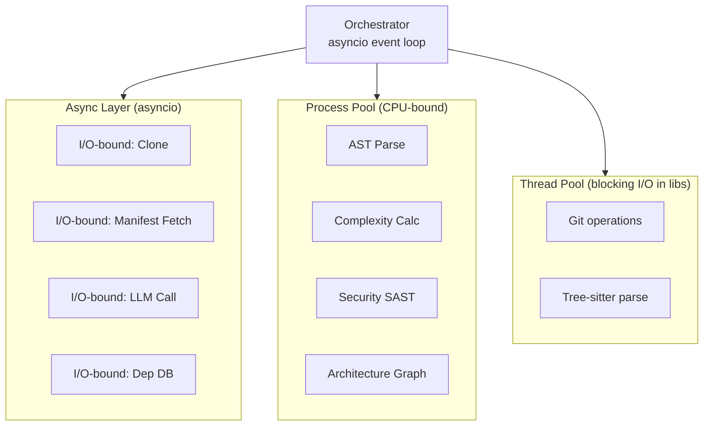

### 13.3 Thread / Process / Async Karşılaştırması

| Model | Uygun Senaryo | Avantaj | Dezavantaj | Bu Projede Kullanım |
|-------|---------------|---------|------------|---------------------|
| **asyncio** | I/O-bound (ağ, LLM, dep DB) | Düşük overhead; yüksek concurrency | CPU-bound'a uygun değil | LLM, dep DB, clone |
| **ThreadPool** | Blocking I/O (C ext'leri) | GIL altında basit | GIL sınırlı paralellik | Tree-sitter (GIL release eder ama), git |
| **ProcessPool** | CPU-bound (AST, complexity) | Gerçek paralellik; GIL yok | Process maliyeti; serialization | AST parse, complexity, SAST |

> **ADR-006: Concurrency Modeli** — Hibrit: `asyncio` (orkestrasyon) + `ProcessPoolExecutor` (CPU-bound analiz) + `ThreadPoolExecutor` (blocking I/O wrapper). Tek model tüm ihtiyaçları karşılamaz.

### 13.4 Ölçeklenebilirlik Taktikleri

| Taktik | Sorun | Çözüm |
|--------|-------|-------|
| **Streaming file read** | Büyük dosya bellek şişirmesi | Satır/Dosya bazlı streaming; tüm dosyayı belleğe yükleme. |
| **Lazy AST** | AST cache için bellek | İhtiyaç anında parse; cache optional. |
| **Chunked analysis** | 1M satır tek seferde | Dosyaları shard'lara böl; paralel process. |
| **Incremental cache** | Tekrar analiz | commit bazlı cache (Bölüm 9). |
| **Backpressure** | Process pool doyma | Semaphore ile concurrency limit. |
| **Memory-mapped I/O** | Büyük dosya okuma | `mmap` ile dosya erişimi. |
| **Selective analysis** | Test/build artifact'lar | Exclude pattern (`.gitignore` + özel). |

### 13.5 LLM Maliyet Optimizasyonu

| Teknik | Kazanç |
|--------|--------|
| Context compression (bulguları özetle) | ~%60 token azalması. |
| Chunking + map-reduce | Tek prompt limit aşmaz. |
| Semantic dedup of findings | Yinelenen bulgular LLM'e gitmez. |
| Tiered models (küçük özet → büyük derin analiz) | Maliyet ~%40 azalma. |
| Response caching (prompt hash) | Tekrar analizde LLM çağrılmaz. |

### 13.6 Benchmark Yaklaşımı

- **Fixture repolar**: 5 boyut kategorisi (tiny/small/medium/large/huge).
- **CI benchmark**: Her PR'da benchmark koş; regresyon alarmı.
- **Profiling**: `py-spy` ile flamegraph; darboğaz tespiti.

---

## 14. Güvenlik Tasarımı

### 14.1 Private Repository Desteği

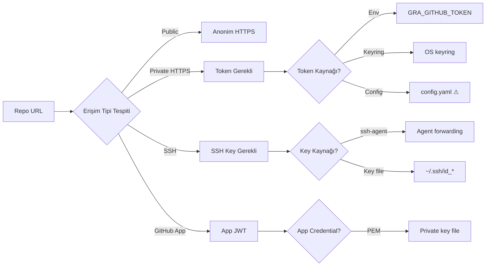

### 14.2 Credential Yönetimi

| Credential | Saklama | Öncelik | Not |
|-----------|---------|:---:|-----|
| GitHub PAT | OS keyring (önerilen) | 1 | Şifreli; kullanıcı bazlı. |
| GitHub PAT | Env var `GRA_GITHUB_TOKEN` | 2 | CI/CD için ideal. |
| GitHub PAT | `gh auth` entegrasyonu | 3 | Mevcut GitHub CLI. |
| SSH key | `ssh-agent` | 1 | Anahtar diske açık yazılmaz. |
| GitHub App | PEM file + App ID | — | Dosya izni 600. |

> **Kural**: Token **asla** config.yaml'a açık text yazılmaz. Yazılırsa uyarı + redaction.

### 14.3 Token Saklama Akışı

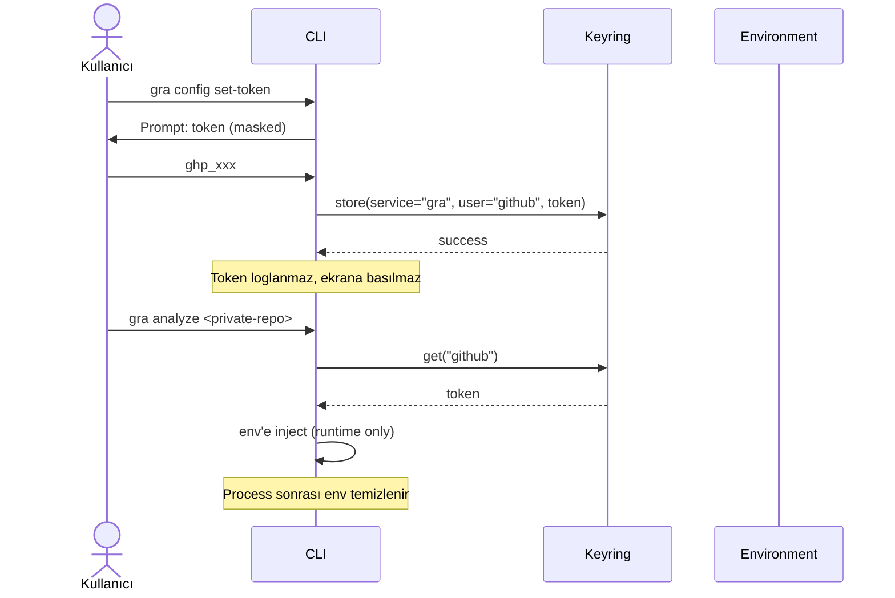

### 14.4 Geçici Dosya Yönetimi

| Aşama | Önlem |
|-------|-------|
| Clone | `tempfile.TemporaryDirectory` ile izole dizin. |
| Sensitive dosya okuma (`.env`) | Bellekte işle; diske yazma. |
| Rapor üretimi | Çıktı dizini config; geçici dosya yok. |
| Cleanup | `finally` bloğunda guaranteed cleanup; signal handler (SIGINT/SIGTERM). |
| Crash sonrası kalıntı | Startup'ta stale temp dizin tespiti + temizlik. |
| Disk doldu | Yazım öncesi disk alanı kontrolü. |

### 14.5 Güvenlik Kontrolleri Listesi

| # | Kontrol | Durum |
|---|---------|-------|
| 1 | Token log/redaction | Zorunlu |
| 2 | Temp dosya 0600 izin | Zorunlu |
| 3 | SSH anahtar diske açık yazma | Yasak |
| 4 | Cache dizini 0700 izin | Zorunlu |
| 5 | Token process sonrası env temizliği | Zorunlu |
| 6 | Crash dump'ta credential yok | Redaction filter |
| 7 | Plugin kod imzası (opt-in) | Önerilen |
| 8 | Network egress whitelist (config) | Önerilen |

### 14.6 Supply Chain Güvenliği

- **Bağımlılık kilitleme**: `pip-tools` / `uv lock` ile lockfile.
- **Hassan belge doğrulama**: `pip-audit` CI'da.
- **SBOM üretimi**: Analiz sonucunda CycloneDX SBOM (opsiyonel).

---

## 15. Rapor Mimarisi

Rapor üretimi, **ortak bir abstraction** üzerinden çoklu format desteği sunar.

### 15.1 Rapor Mimarisi Diyagramı

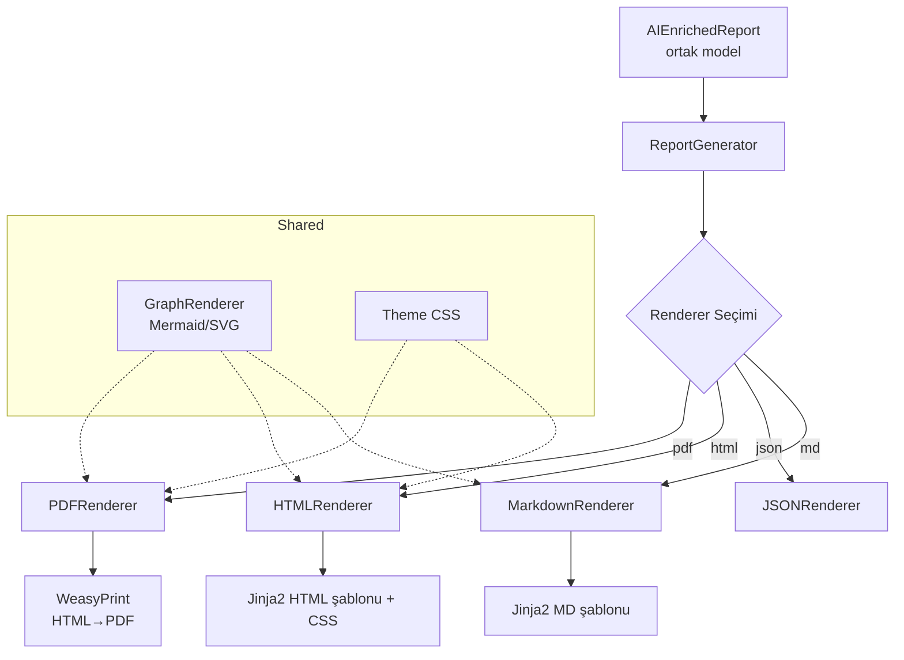

### 15.2 Ortak Abstraction (Output Port)

| Metot | İmza | Açıklama |
|-------|------|----------|
| `render(report)` | `→ bytes` | Raporu hedef formata çevir. |
| `supports_graphs()` | `→ bool` | Format grafik destekliyor mu? |
| `mime_type()` | `→ str` | MIME tipi. |
| `extension()` | `→ str` | Dosya uzantısı. |

### 15.3 Format Karşılaştırması

| Format | İnsan-okur | Makine | Grafik | Stil | Bağımlılık |
|--------|:---:|:---:|:---:|:---:|---|
| Markdown | ✅ | ⚠ | Mermaid (text) | Sınırlı | `markdown` |
| JSON | ❌ | ✅✅ | ❌ | ❌ | stdlib |
| HTML | ✅✅ | ⚠ | SVG/Canvas | ✅✅ | Jinja2 |
| PDF | ✅✅ | ❌ | SVG | ✅✅ | WeasyPrint |

### 15.4 Rapor Bölümleri

| Bölüm | İçerik |
|-------|--------|
| 1. Executive Summary | Health score, grade, kritik bulgu sayısı. |
| 2. Repository Info | URL, commit, dil dağılımı, LOC. |
| 3. Health Score | Alt skorlar + ağırlıklar. |
| 4. Security Findings | Severity grubuna göre; fix önerileri. |
| 5. Code Quality | Complexity, duplication, code smells. |
| 6. Architecture | Layer diagram, cycles, coupling/cohesion. |
| 7. Dependencies | Bağımlılık ağacı, lisans, vulnerability. |
| 8. Test & Docs | Coverage, test smells, doc gaps. |
| 9. AI Review | Özet, güçlü yönler, riskler, öneriler. |
| 10. Appendix | Tüm bulgular tablosu, config snapshot. |

### 15.5 Template Stratejisi

- **Jinja2** şablonları; ayrı dosyalarda; kullanıcı override edebilir (`--template-dir`).
- **Temalar**: `default`, `dark`, `minimal` (HTML/PDF için).
- **Lokalizasyon**: Şablonlar i18n-ready (gelecek).

> **ADR-007: Rapor Abstraction** — Tek `OutputPort` + çoklu renderer. Yeni format (örn. SARIF) eklemek için yalnızca yeni bir renderer sınıfı yazmak yeterli.

---

## 16. AI Entegrasyonu

### 16.1 AI Motorunun Konumu

AI Review Engine, pipeline'ın **en son analiz motorudur** (Faz 5). Diğer tüm motorların bulgularını **sentezler**; sıfırdan analiz yapmaz.

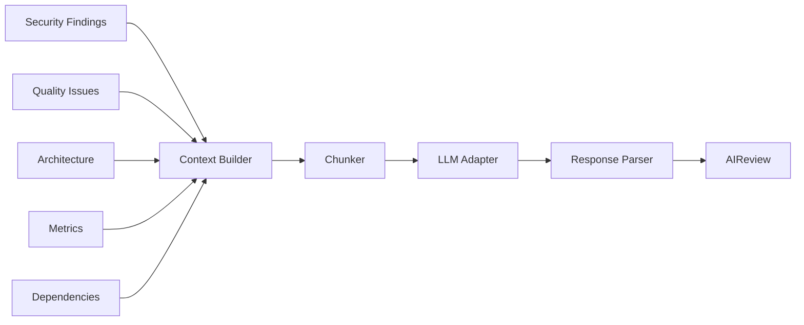

### 16.2 AI'ya Verilen Veriler

| Veri | Format | Amaç |
|------|--------|------|
| Repo metadata | JSON | Bağlam (dil, boyut, commit). |
| Health score | JSON | Genel durum. |
| Security findings (top N) | JSON | Kritik açıklar. |
| Quality issues (top N) | JSON | Kalite sorunları. |
| Architecture smells | JSON | Mimari kokuları. |
| Dependency vulns | JSON | Bağımlılık açıkları. |
| Metrik özeti | JSON | Sayısal durum. |
| Code snippet'leri (kritik) | text | Spesifik inceleme. |

### 16.3 Prompt Mühendisliği

**System prompt** (rol): Kıdemli Software Architect + DevSecOps rolü; teknik, somut, fix odaklı.

**Structured prompt şablonu**:

| Bölüm | İçerik |
|-------|--------|
| Role | "You are a Staff Software Engineer and DevSecOps Architect..." |
| Context | Repo metadata + skor. |
| Findings | JSON blok (redacted sensitive). |
| Task | "Summarize, identify top 5 risks, recommend prioritized fixes." |
| Constraints | "Be concrete. Cite finding IDs. Avoid generic advice." |
| Output format | JSON schema ( strengths[], risks[], recommendations[] ). |

### 16.4 Chunking Stratejisi

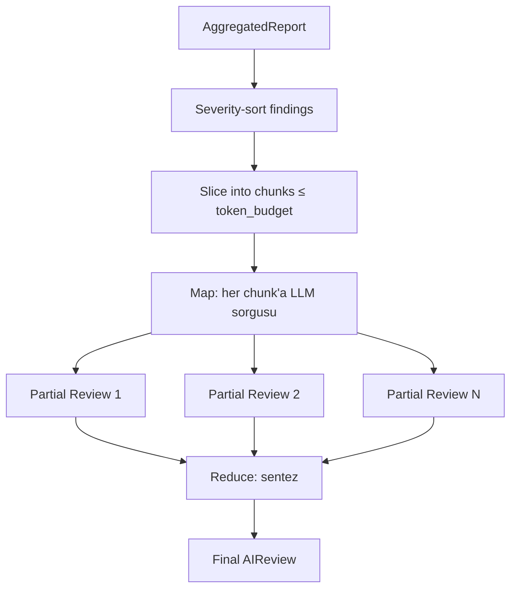

- **Map-reduce**: Her chunk bağımsız analiz → final reduce.
- **Token budget**: Model context window'unun %70'i (güvenlik marjı).
- **Priority chunking**: CRITICAL/HIGH findings ilk chunk'a gider.

### 16.5 Token Maliyet Optimizasyonu

| Teknik | Kazanç | Risk |
|--------|--------|------|
| Finding deduplication | %20-40 token azalma | Düşük |
| Finding summarization (pre-LLM) | %50 azalma | Orta (detay kaybı) |
| Tiered model (haiku özet → opus derin) | %40 maliyet azalma | Orta |
| Response caching (prompt hash) | %100 (cache hit) | Düşük |
| Selective code snippet | %30 azalma | Orta |
| Structured output (JSON mode) | Parse güvenilirliği | Yok |

### 16.6 LLM Adapter Çokluğu

```mermaid
classDiagram
    class LLMPort {
        <<interface>>
        +complete(prompt, opts) Response
        +complete_stream(prompt) Iterator
        +count_tokens(text) int
        +max_context() int
    }
    class ZAIAdapter {
        z-ai-web-dev-sdk
    }
    class OpenAIAdapter
    class AnthropicAdapter
    class LocalAdapter {
        Ollama / llama.cpp
    }
    class MockLLMAdapter {
        test
    }

    LLMPort <|-- ZAIAdapter
    LLMPort <|-- OpenAIAdapter
    LLMPort <|-- AnthropicAdapter
    LLMPort <|-- LocalAdapter
    LLMPort <|-- MockLLMAdapter
```

> **ADR-004: LLM Provider** — Port-Adapter pattern; varsayılan z-ai-web-dev-sdk, config ile değiştirilebilir. Fallback zinciri desteklenir (primary fail → secondary).

### 16.7 AI Güvenilirliği

- **Hallucination önlemi**: AI yalnızca **bulguları** yorumlar; uydurma bulgu üretmesi engellenir (output schema finding ID'lerini referans alır).
- **Confidence score**: AI kendi güvenini raporlar; düşük güven uyarı işaretlenir.
- **Determinism**: `temperature=0.2` (tutarlılık); `seed` desteği.
- **Fallback**: LLM başarısız → AI'sız rapor (AI bölümü boş + uyarı).

---

## 17. Test Stratejisi

### 17.1 Test Piramidi

```mermaid
flowchart TB
    subgraph Pyramid
        E2E[E2E Tests<br/>~5%<br/>Tam pipeline gerçek repo]
        INT[Integration Tests<br/>~20%<br/>Modüller arası]
        UNIT[Unit Tests<br/>~75%<br/>Tek modül, mock'lu]
    end
    E2E --> INT --> UNIT
```

### 17.2 Test Türleri

| Tür | Amaç | Araç | Oran |
|-----|------|------|:---:|
| **Unit** | Tek fonksiyon/sınıf izole. | pytest, pytest-mock | ~75% |
| **Integration** | Modüller arası; fake VCS/LLM. | pytest, fixtures | ~20% |
| **E2E** | Tam pipeline gerçek küçük repo. | pytest, subprocess | ~5% |
| **Golden** | Bilinen çıktı sabit karşılaştırma. | pytest, golden fixture | Senaryo bazlı |
| **Snapshot** | Rapor çıktısı snapshot. | pytest-snapshot | Rapor formatları |
| **Property-based** | Invariant test (örn. cache key deterministik). | hypothesis | Domain logic |
| **Mutation** | Test kalitesi (mutant öldürme). | mutmut | Kritik modüller |

### 17.3 Mock ve Fixture Stratejisi

| Bağımlılık | Mock Yöntemi |
|-----------|--------------|
| VCS (git) | Fake VCS adapter; fixture repo klonları `tests/fixtures/`. |
| LLM | `MockLLMAdapter` (deterministik yanıt). |
| Filesystem | `tmp_path` fixture (her test izole dizin). |
| Network | `responses` / `aiohttp` mock; OSV DB offline fixture. |
| Clock | `freezegun` (cache expiration test). |

### 17.4 Test Fixture Repoları

| Fixture | Özellik | Amaç |
|---------|---------|------|
| `tiny_repo` | 10 dosya, tek dil | Hızlı unit. |
| `multi_lang_repo` | 3+ dil | Language detector. |
| `vulnerable_repo` | Bilni kasıtlı açıklar | Security analyzer golden. |
| `clean_repo` | Sıfır bulgu | False-positive test. |
| `huge_repo` (symlink) | Büyük repo referansı | Performance (manuel). |

### 17.5 CI Test Aşamaları

| Aşama | Tetikleyici | İçerik |
|-------|-------------|--------|
| `lint` | Her commit | ruff, mypy. |
| `unit` | Her commit | Hızlı unit test paketi. |
| `integration` | Her PR | Integration + golden. |
| `e2e` | Nightly + release | Tam pipeline (yavaş). |
| `mutation` | Haftalık | Kritik modüller. |

### 17.6 Coverage Hedefleri

| Katman | Hedef |
|--------|:---:|
| `core/` (domain) | ≥ 95% |
| `analyzers/` | ≥ 85% |
| `adapters/` | ≥ 80% (mock'lu) |
| `cli/` | ≥ 70% |
| Genel | ≥ 85% |

---

## 18. Geliştirme Yol Haritası

### 18.1 Sürüm Planı

```mermaid
gantt
    title github-repo-analyzer Yol Haritası
    dateFormat  YYYY-MM-DD
    section MVP
    MVP (çekirdek pipeline)        :mvp, 2025-01-01, 30d
    section v0.1
    Stabil analiz motorları        :v01, after mvp, 45d
    section v0.5
    Plugin sistemi + AI            :v05, after v01, 60d
    section v1.0
    Tüm formatlar + güvenlik       :v10, after v05, 45d
    section v2.0
    Enterprise özellikler          :v20, after v10, 60d
```

### 18.2 Sürüm İçerikleri

#### MVP (Çekirdek Pipeline)

| Özellik | Durum |
|---------|-------|
| CLI: `analyze <url>` (public HTTPS) | ✅ |
| Clone (shallow) + cache (basit) | ✅ |
| Language detector | ✅ |
| Filesystem + AST + Complexity analyzer | ✅ |
| Markdown + JSON rapor | ✅ |
| Health score (basit) | ✅ |
| Config (yaml + env) | ✅ |

**MVP'de yok**: AI, plugin, security SAST, HTML/PDF, private repo.

#### v0.1 (Stabil Analiz Motorları)

| Özellik |
|---------|
| Tüm 10 analiz motoru (AI hariç). |
| Security analyzer (SAST + secret + dependency). |
| Architecture analyzer (cycles, layers). |
| Git history analyzer. |
| Test + documentation analyzer. |
| Private repo (token) + SSH desteği. |
| Cache expiration + LRU. |
| Structured logging. |
| Exception hiyerarşisi. |
| Golden test altyapısı. |

#### v0.5 (Plugin + AI)

| Özellik |
|---------|
| Plugin sistemi (entry points + dizin tarama). |
| Plugin lifecycle + sandbox. |
| AI Review Engine (z-ai-web-dev-sdk). |
| LLM adapter çokluğu (OpenAI, Anthropic). |
| Chunking + map-reduce. |
| AI response caching. |
| HTML + PDF rapor. |
| Graph generator (Mermaid + SVG). |
| Performance: ProcessPool paralelleştirme. |
| SBOM üretimi (CycloneDX). |

#### v1.0 (Production-Ready)

| Özellik |
|---------|
| Tüm 4 VCS erişim modu stabilize. |
| Keyring credential yönetimi. |
| Plugin imza doğrulama (opt-in). |
| Network egress whitelist. |
| Lokalizasyon (TR/EN). |
| Temalar (dark/minimal). |
| Tam dokümantasyon + API referansı. |
| Mutation test coverage. |
| Benchmark CI + regression alarmı. |
| Performance hedefleri karşılandı. |
| Security audit (3rd party). |

#### v2.0 (Enterprise)

| Özellik |
|---------|
| CI/CD entegrasyonu (GitHub Action, GitLab CI). |
| SARIF çıktı (GitHub Code Scanning). |
| Policy engine (OPA/Rego) — custom kurallar. |
| Trend analizi (multi-commit karşılaştırma). |
| Monorepo desteği (package bazlı analiz). |
| Diff analizi (sadece değişen dosyalar). |
| Web UI (opsiyonel dashboard). |
| Takım bazlı config / policy preset'leri. |
| Self-hosted LLM (Ollama) tam entegrasyon. |
| MCP server modu (AI assistant entegrasyonu). |

---

## 19. Risk Analizi

### 19.1 Teknik Risk Matrisi

| # | Risk | Olasılık | Etki | Skor | Azaltma |
|---|------|:---:|:---:|:---:|---------|
| R1 | Çok dilli AST tutarsızlığı | Orta | Yüksek | 12 | Tree-sitter standart; dil bazlı test. |
| R2 | Büyük repoda bellek şişmesi | Yüksek | Yüksek | 16 | Streaming + partial clone + shard. |
| R3 | LLM maliyet kontrolsüz artar | Orta | Orta | 9 | Tiered model + caching + budget. |
| R4 | Plugin güvenlik zaafiyeti | Orta | Yüksek | 12 | İmza + sandbox + whitelist. |
| R5 | Git operasyon güvenilirliği | Düşük | Yüksek | 8 | Dulwich fallback + retry. |
| R6 | Cache bütünlük bozulması | Düşük | Orta | 4 | Checksum + validation. |
| R7 | GitHub API rate limit | Orta | Düşük | 6 | Token + backoff + cache. |
| R8 | AI hallucination | Orta | Orta | 9 | Schema-constrained output + ID referans. |
| R9 | Config karmaşıklığı | Yüksek | Düşük | 6 | Profile preset + validation. |
| R10 | Cross-platform (Win/Mac/Linux) | Orta | Orta | 9 | CI matrix test; pathlib kullanımı. |

> Skor = Olasılık (1-4) × Etki (1-4). ≥12 kritik.

### 19.2 Kritik Darboğazlar

```mermaid
flowchart LR
    B1[DARBOĞAZ 1<br/>LLM gecikme<br/>5-30 sn/sorgu] --> MIT1[Tiered model<br/>+ caching<br/>+ parallel chunks]
    B2[DARBOĞAZ 2<br/>Büyük repo clone<br/>dk'lar] --> MIT2[Partial clone<br/>+ sparse checkout<br/>+ cache]
    B3[DARBOĞAZ 3<br/>AST parse CPU<br/>1M satır dk'lar] --> MIT3[ProcessPool<br/>+ lazy parse<br/>+ AST cache]
    B4[DARBOĞAZ 4<br/>Dependency DB ağ<br/>saniyeler] --> MIT4[Offline DB<br/>+ cache<br/>+ async]
```

### 19.3 Ölçeklenebilirlik Sorunları

| Sorun | Belirti | Çözüm |
|-------|---------|-------|
| Cache şişmesi | Disk dolması | LRU + size limit + pruning job. |
| Plugin sayısı arttıkça yavaşlama | Startup süresi | Lazy loading; yalnızca gerekli plugin'ler. |
| LLM context aşımı | Token error | Chunking + summarization. |
| Çok büyük dependency graph | Bellek | Graph pruning; top-N gösterim. |
| Çok dil desteği | Bakım maliyeti | Tree-sitter ortak; dil modülleri izole. |

### 19.4 Operasyonel Riskler

| Risk | Etki | Azaltma |
|------|------|---------|
| Kullanıcı credential sızdırma | Kritik | Keyring + redaction + eğitim. |
| Geçici dosya kalıntı | Disk | Startup cleanup + signal handler. |
| Yanlış pozitif güvenlik bulgusu | Güven kaybı | Confidence + dedup + kural tuning. |
| AI yanıltıcı yorum | Yanlış aksiyon | Confidence + "review before action" uyarısı. |

---

## 20. Nihai Yazılım Mimarisi (Son Karar)

### 20.1 Nihai Mimari Özeti

`github-repo-analyzer` için önerilen **kesin mimari** aşağıdaki bileşenlerin birleşimidir:

```mermaid
flowchart TB
    subgraph Final["Nihai Mimari"]
        direction TB
        L1["Organizasyon: Modular Monolith<br/>Tek process, net modül sınırları"]
        L2["Çekirdek: Hexagonal (Ports & Adapters)<br/>Framework-bağımsız core"]
        L3["Genişletme: Plugin Architecture<br/>Analyzer'lar = plugin"]
        L4["Orkestrasyon: Pipeline + Fazlar<br/>Paralel faz içi, sıralı fazlar arası"]
        L5["Concurrency: Hibrit<br/>asyncio + ProcessPool + ThreadPool"]
        L6["Cache: SQLite + FS Hibrit<br/>commit-bazlı key, LRU, TTL"]
        L7["AI: Port-Adapter LLM<br/>z-ai varsayılan, map-reduce chunking"]
        L8["Rapor: OutputPort abstraction<br/>MD/JSON/HTML/PDF renderer"]
        L9["Config: Pydantic Settings<br/>yaml → env → CLI overlay"]
        L10["Security: Keyring + redaction<br/>temp cleanup + sandbox plugin"]
    end

    L1 --> L2 --> L3 --> L4
    L4 --> L5
    L4 --> L6
    L4 --> L7
    L4 --> L8
    L4 --> L9
    L4 --> L10
```

### 20.2 Nihai Mimari Neden Seçildi? (Teknik Gerekçe)

#### Gerekçe 1: Hexagonal Core — Adapter Çoğulluğu Zorunlu

Proje **dört VCS erişim modu**, **çoklu LLM sağlayıcı** ve **dört rapor formatı** gerektirir. Bu, en az 12 adapter demektir. Hexagonal mimari, her adapter'ı bağımsız geliştirilebilir, test edilebilir ve değiştirilebilir kılar. Diğer mimariler bu kadar doğal adapter ayrımı sunmaz.

**Trade-off kabulü**: Port interface kalabalığı. **Telafi**: Interface'ler tek dosyada gruplanır; base abstract sınıflarla tekrar azaltılır.

#### Gerekçe 2: Plugin Architecture — Genişletilebilirlik Açık Gereksinim

Kullanıcı açıkça "gelecekte yeni analiz motorları eklenebilmeli" diyor. Plugin mimarisi olmazsa her yeni analyzer çekirdek kod değişikliği gerektirir; OCP ihlal edilir. Plugin + entry points ile `pip install gra-plugin-xyz` çalışan bir analyzer olur.

**Trade-off kabulü**: Plugin lifecycle karmaşıklığı + güvenlik. **Telafi**: Sandbox, imza, quota (Bölüm 8.5).

#### Gerekçe 3: Modular Monolith — CLI Doğası

CLI tek process'tir; dağıtık mimari (microservice) overkill. Modular Monolith, modüller arası net sınır + tek process dağıtım dengesi sunar. Event-driven'ın karmaşıklığı (event bus, eventual consistency) CLI için gereksiz.

**Trade-off kabulü**: Modüller arası runtime isolation yok. **Telafi**: Test disiplini + interface contract'ları.

#### Gerekçe 4: Pipeline + Fazlar — Analiz Doğal Akışı

Analiz motorları doğal bağımlılıklara sahiptir (AST → Import → Architecture). Pipeline, bu bağımlılıkları fazlarla ifade eder; faz içi paralellik performans verir. Bu, düz sequential'dan hızlı, event-driven'dan deterministiktir.

#### Gerekçe 5: Hibrit Concurrency — Tek Model Yetersiz

- I/O-bound (LLM, dep DB, clone) → asyncio
- CPU-bound (AST, complexity, SAST) → ProcessPool
- Blocking I/O wrapper (git, tree-sitter) → ThreadPool

Tek model (sadece async veya sadece thread) tüm senaryoları kapsayamaz. Hibrit, her iş tipine uygun aracı seçer.

#### Gerekçe 6: SQLite + FS Cache — Ek Servis Yok

Redis ek servis + operasyon yükü demek; CLI için kabul edilemez. SQLite (metadata) + FS (clone) zero-dependency, yeterli performans, taşınabilir.

#### Gerekçe 7: Pydantic Settings — Tip Güvenli Config

YAML + env + CLI overlay manuel yönetimi hataya açıktır. Pydantic Settings, tip doğrulama + öncelik yönetimini tek noktada çözer; config hatası startup'ta yakalanır.

### 20.3 Reddedilen Alternatifler ve Neden

| Alternatif | Neden Reddedildi |
|-----------|------------------|
| Layered (n-tier) | Esneklik yetersiz; plugin zor. |
| Event-Driven | CLI için overkill; debug zor. |
| Mikroservis | Dağıtım karmaşıklığı; CLI değil. |
| Sadece async (no process pool) | CPU-bound analiz GIL'de tıkanır. |
| Sadece process pool | I/O için wasteful; process maliyeti. |
| Redis cache | Ek servis; operasyon yükü. |
| Monolitik config (kodda sabit) | Esneklik yok; CI dostu değil. |
| Token config.yaml'da açık | Güvenlik zaafiyeti. |

### 20.4 Mimari Tutarlılık Kontrolü

| İlke | Karşılığı |
|------|-----------|
| SRP (Tek Sorumluluk) | Her modül tek iş; analyzer başına ayrı sınıf. |
| OCP (Açık-Kapalı) | Plugin ile yeni analyzer ekleme; çekirdek değişmez. |
| LSP | Adapter'lar port'u substitutable uygular. |
| ISP | Port'lar küçük, odaklı interface. |
| DIP | Core adapter'lara değil port'lara bağımlı. |
| DRY | Domain model tek yerde; adapter'lar tekrar etmez. |
| KISS | Event-driven/Redis gibi karmaşıklıktan kaçınıldı. |
| YAGNI | v2.0 enterprise özellikleri MVP'de yok. |

### 20.5 Final Mimari Diyagramı (C4 Model — Component Seviyesi)

```mermaid
flowchart TB
    subgraph CLI_Layer
        CLI[CLI App<br/>Typer + Rich]
    end

    subgraph Core["Hexagonal Core"]
        ORC[Orchestrator]
        DOM[Domain Model]
        PORT[Ports]
        AGG[Aggregator]
    end

    subgraph Adapters
        VCS[VCS Adapter<br/>git/dulwich/gh]
        LLM[LLM Adapter<br/>zai/openai/anthropic]
        OUT[Output Adapter<br/>md/json/html/pdf]
        CCH[Cache Adapter<br/>sqlite+fs]
    end

    subgraph Plugins["Plugin Subsystem"]
        PM[Plugin Manager]
        A1[Security]
        A2[Complexity]
        A3[Architecture]
        A4[AI Review]
        AN[...]
    end

    subgraph Infra
        CFG[Config]
        LOG[Logger]
        ERR[Error Handler]
        SEC[Security/Credential]
    end

    CLI --> ORC
    ORC --> DOM
    ORC --> PORT
    ORC --> AGG
    PORT -.implemented by.-> VCS
    PORT -.implemented by.-> LLM
    PORT -.implemented by.-> OUT
    PORT -.implemented by.-> CCH
    ORC --> PM
    PM --> A1 & A2 & A3 & A4 & AN
    CFG -.-> ORC
    LOG -.-> ORC
    ERR -.-> ORC
    SEC -.-> VCS
```

---

## Ek: ADR Özeti

Aşağıdaki Architecture Decision Record'lar bu doküman boyunca alınmıştır:

| ADR | Başlık | Karar | Durum |
|-----|--------|-------|-------|
| ADR-001 | Mimari Desen Seçimi | Hexagonal + Plugin + Modular Monolith | Kabul |
| ADR-002 | CLI Framework | Typer + Rich | Kabul |
| ADR-003 | Cache Stratejisi | SQLite (meta) + FS (clone) hibrit | Kabul |
| ADR-004 | LLM Provider | Port-Adapter; varsayılan z-ai-web-dev-sdk | Kabul |
| ADR-005 | Config Yönetimi | Pydantic Settings + YAML + env + CLI | Kabul |
| ADR-006 | Concurrency Modeli | Hibrit: asyncio + ProcessPool + ThreadPool | Kabul |
| ADR-007 | Rapor Abstraction | Tek OutputPort + çoklu renderer | Kabul |
| ADR-008 | Plugin Güvenliği | İmza (opt-in) + sandbox + quota | Kabul |
| ADR-009 | Credential Saklama | OS keyring öncelikli; config.yaml'a açık yazma yasak | Kabul |
| ADR-010 | AI Hallucination Önlemi | Schema-constrained output + finding ID referans | Kabul |
| ADR-011 | Exception Hiyerarşisi | Fatal / Recoverable / Transient kategorileri | Kabul |
| ADR-012 | Test Piramidi | Unit 75% / Integration 20% / E2E 5% | Kabul |

---

## Kapanış

Bu doküman, `github-repo-analyzer` projesi için **tam kapsamlı bir Yazılım Tasarım Dokümanı (SDD)** olup; mimari, modül, domain, analiz motorları, plugin, cache, config, error handling, logging, performans, güvenlik, rapor, AI entegrasyonu, test, yol haritası ve risk analizini kapsar. Her karar **teknik gerekçe** ve **trade-off analizi** ile sunulmuştur.

**Nihai mimari**: Hexagonal Core + Plugin Architecture + Modular Monolith organizasyonu + Pipeline orkestrasyon + Hibrit concurrency. Bu kombinasyon, projenin çoklu adapter, genişletilebilirlik, performans ve güvenlik gereksinimlerini en düşük karmaşıklıkla karşılar.

> **Not**: Bu doküman implementasyon içermez. Bir sonraki aşama, bu SDD'yi temel alan artan bir implementasyon (MVP → v2.0) sürecidir.
